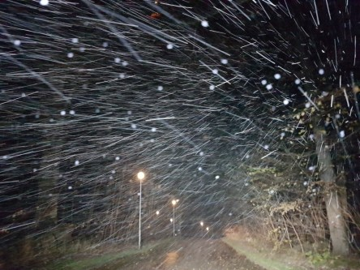
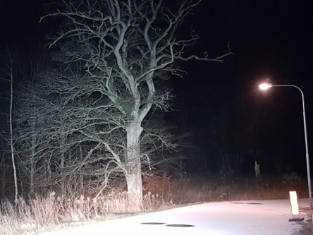

Idag går solen upp 07:47 och ned 15:44. Månen går upp 09:16 och ned 17:24 Månen är belyst 2 %. Dagens längd är 7 timmar och 57 minuter.

 Mest molnigt - 1 C  Vindby 3 m/s SE  Luftfuktighet 82 %  hPa 1001 Kl.02:05

 Mest molnigt och en del snö - 1,2 C Vindby 2,2 m/s SW  Luftfuktighet 75 %  hPa 1002 Kl.06:40

 Växlande molnighet 3,9 C  Vindby 3,1 m/s NE  Luftfuktighet 68 %  hPa 1005 Kl.14:05

 Molnigt - 2,4 C  Vindby 1,6 m/s SW  Luftfuktighet 91 %  hPa 1006 Kl.20:15

 

Högst och lägst uppmätta temperatur igår (inofficiellt privat mätare): Max 8,1 C , Min - 0,9 C Högst uppmätta vind 3,4 m/s. Högst uppmätta vindby 5,4 m/s.

Högst och lägst uppmätta temperatur igår (officiellt enligt [YR.NO](http://www.vackertvader.se/v%C3%A4derstation/karlshamn?utm_source=email&utm_medium=email&utm_campaign=asarum)) Max 5,7 C, Min - 0,7 C Högst uppmätta vind 4,5 m/s. Högst uppmätta vindby 10,7 m/s

 

 Från snöyra och blåsigt till en vacker solnedgång och kallt.
