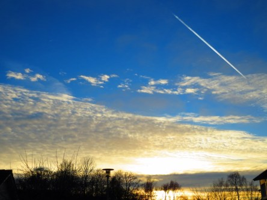

Idag går solen upp 07:49 och ned 15:42. Månen går upp 10:12 och ned 18:06 Månen är belyst 6 %. Dagens längd är 7 timmar och 53 minuter.

 Molnigt - 3,3 C  Vindby 0,8 m/s SW  Luftfuktighet 87 %  hPa 1006 Kl.02:00

 Växlande molnighet - 4 C  Vindby 1,6 m/s SSW  Luftfuktighet 85 %  hPa 1006 Kl.06:30

 Mest molnigt - 0,9 C  Vindby 1 m/s E  Luftfuktighet 79 %   hPa 1007 Kl.14:35

 Växlande molnighet - 4,2 C  Vindby 0,3 m/s NE  Luftfuktighet 89 %  hPa 1007 Kl.21:05

 

Högst och lägst uppmätta temperatur igår (inofficiellt privat mätare): Max 5,3 C , Min – 3,4 C Högst uppmätta vind 2,4 m/s. Högst uppmätta vindby 5,4 m/s.

Högst och lägst uppmätta temperatur igår (officiellt enligt [YR.NO](http://www.vackertvader.se/v%C3%A4derstation/karlshamn?utm_source=email&utm_medium=email&utm_campaign=asarum)) Max 1,2 C, Min – 2,9 C Högst uppmätta vind 3,2 m/s. Högst uppmätta vindby 8 m/s

 

 För mig som jobbar natt och sover på förmiddagen så blir det inte mycket jag hinner se av dagsljuset längre. Det blir nästan bara solnedgången jag hinner se.
