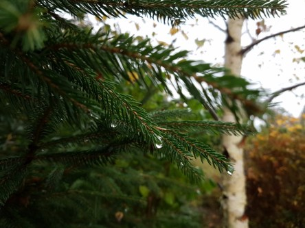

Idag går solen upp 07:43 och ned 17:45. Månen går upp 09:10 och ned 18:55 Månen är belyst 2 %. Dagens längd är 10 timmar och 2 minuter.

 Molnigt och en del regnskurar 10,8 C  Vindby 2,2 m/s SW  Luftfuktighet 98 %  hPa 1009  Regn 1,7 mm Kl.01:20

 Regn 10,2 C  Vindby 1,8 m/s SW  Luftfuktighet 99 %  hPa 1008  Regn 5,5 mm Kl.06:25

 Regn 11,1 C  Vindby 3,8 m/s W  Luftfuktighet 99 %  hPa 1010  Regn 6,5 mm Kl.15:00

 Molnigt 9,4 C  Vindby 5 m/s WNW  Luftfuktighet 99 %  hPa 1011  Regn 7,7 mm Kl.19:50

 

Högst och lägst uppmätta temperatur igår (inofficiellt privat mätare): Max 12,5 C , Min 8,8 C Högst uppmätta vind 3,4 m/s. Högst uppmätta vindby 6,5  m/s.

Högst och lägst uppmätta temperatur igår (officiellt enligt [YR.NO](http://www.vackertvader.se/v%C3%A4derstation/karlshamn?utm_source=email&utm_medium=email&utm_campaign=asarum)) Max 11,7 C, Min 9,6 C Högst uppmätta vind 4 m/s. Högst uppmätta vindby 8,9 m/s

 

 Grått och regn hela dagen.

Spara

Spara

Spara
