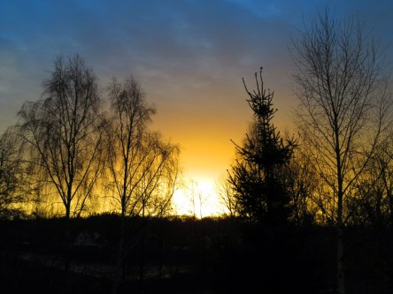

Idag går solen upp 07:55 och ned 15:38. Månen går upp 12:17 och ned 20:53 Månen är belyst 25 %. Dagens längd är 7 timmar och 43 minuter.

 Mest klart 5,1 C  Vindby 2,4 m/s NW  Luftfuktighet 82 %  hPa 998 Kl.02:05

 Mest molnigt 4,7 C  Vindby 2,8 m/s E  Luftfuktighet 91 %  hPa 1000 Kl.07:20

 Lätt regn 6,3 C  Vindby 0,3 m/s NW  Luftfuktighet 95 %  hPa 1000  Regn 1 mm Kl.13:30

 Växlande molnighet 3,7 C  Vindby 0,3 m/s NW  Luftfuktighet 99 %  hPa 1002  Regn 4,2 mm Kl.20:50

 

Högst och lägst uppmätta temperatur igår (inofficiellt privat mätare): Max 10 C , Min 5,6 C Högst uppmätta vind 2,7 m/s. Högst uppmätta vindby 4,8 m/s.

Högst och lägst uppmätta temperatur igår (officiellt enligt [YR.NO](http://www.vackertvader.se/v%C3%A4derstation/karlshamn?utm_source=email&utm_medium=email&utm_campaign=asarum)) Max 9,5 C, Min 6,3 C Högst uppmätta vind 3 m/s. Högst uppmätta vindby 7,5 m/s

 

 Dagens soluppgång innan regn och gråväder tog över igen.
