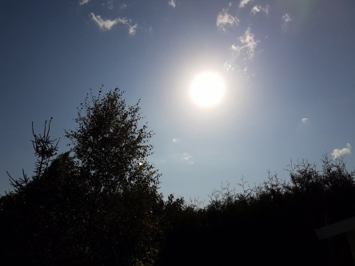

Idag går solen upp 06:50 och ned 18:52. Månen går upp 12:32 och ned 21:21 Månen är belyst 23 %. Dagens längd är 12 timmar och 2 minuter.

 Klart 10,4 C  Vindby 2,4 m/s NW  Luftfuktighet 97 %  hPa 1024 Kl.02:35

 Mest molnigt 11,1 C  Vindby 2 m/s SSE  Luftfuktighet 97 %  hPa 1024 Kl.06:45

 Växlande molnighet 23,2 C  Vindby 3,8 m/s NW  Luftfuktighet 51 %  hPa 1025 Kl.13:45

 Molnigt 13,1 C  Vindby 2,4 m/s SW  Luftfuktighet 83 %  hPa 1026 Kl.20:00

 

Högst och lägst uppmätta temperatur igår (inofficiellt privat mätare): Max 23,9 C , Min 13,1 C Högst uppmätta vind 1,7 m/s. Högst uppmätta vindby 3,4 m/s.

Högst och lägst uppmätta temperatur igår (officiellt enligt [YR.NO](http://www.vackertvader.se/v%C3%A4derstation/karlshamn?utm_source=email&utm_medium=email&utm_campaign=asarum)) Max 20,6 C, Min 12,6 C Högst uppmätta vind 2,3 m/s. Högst uppmätta vindby 6,8 m/s

 

 Idag har solen tittat fram mellan molnen.

Spara

Spara

Spara

Spara

Spara
