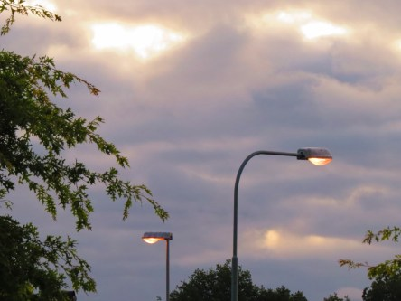

Idag går solen upp 05:51 och ned 20:12. Månen går upp 11:24 och ned 22:06 Månen är belyst 20 %. Dagens längd är 14 timmar och 21 minuter.

 Klart 7,6 C  Vindstilla  Luftfuktighet 97 %  hPa 1011 Kl.02:35

 Mest molnigt 10,6 C  Vindstilla  Luftfuktighet 97 %  hPa 1011 Kl.07:00

 Molnigt 19,6 C  Vindby 1,2 m/s E  Luftfuktighet 74 %  hPa 1012 Kl.12:30

 Molnigt 15,9 C  Vindstilla  Luftfuktighet 83 %  hPa 1011 Kl.19:50

 

Högst och lägst uppmätta temperatur igår (inofficiellt privat mätare): Max 23,4 C , Min 11,4 C Högst uppmätta vind 5,4  m/s. Högst uppmätta vindby 8,5 m/s.

Högst och lägst uppmätta temperatur igår (officiellt enligt [YR.NO](http://www.vackertvader.se/v%C3%A4derstation/karlshamn?utm_source=email&utm_medium=email&utm_campaign=asarum)) Max 20,6 C, Min 10,3 C Högst uppmätta vind 3,9 m/s. Högst uppmätta vindby 19,3 m/s

 

Spara

Spara

Spara

Spara
