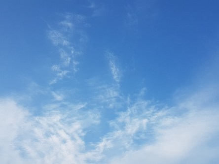
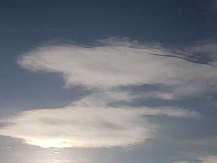

Idag går solen upp 06:54 och ned 18:47. Månen går upp 14:32 och ned 22:34 Månen är belyst 40 %. Dagens längd är 11 timmar och 53 minuter.

 Molnigt 11,8 C  Vindby 1,2 m/s W  Luftfuktighet 98 %  hPa 1028 Kl.02:25

 Tunna moln 11,5 C  Vindby 1 m/s SSW  Luftfuktighet 97 %  hPa 1028 Kl.07:00

 Molnigt 21,2 C   Vindby 6,2 m/s NW  Luftfuktighet 62 %  hPa 1029 Kl.13:40

 Växlande molnighet 11 C  Vindby 3,4 m/s SW  Luftfuktighet 88 %  hPa 1029 Kl.20:30

 

Högst och lägst uppmätta temperatur igår (inofficiellt privat mätare): Max 23,7 C , Min 11,3 C Högst uppmätta vind 2,4 m/s. Högst uppmätta vindby 4,8 m/s.

Högst och lägst uppmätta temperatur igår (officiellt enligt [YR.NO](http://www.vackertvader.se/v%C3%A4derstation/karlshamn?utm_source=email&utm_medium=email&utm_campaign=asarum)) Max 19,4 C, Min 12,3 C Högst uppmätta vind 4,5 m/s. Högst uppmätta vindby 9,1 m/s

 

 Även idag har det förekommit flera olika molntyper. Det översta är ett Cirrostratus eller slöjmoln med en halv halo. Det andra är cirrus eller fjädermoln. De två nedersta är altocumulus lenticularis eller linsformade böljemoln.

Spara

Spara

Spara

Spara

Spara

Spara
