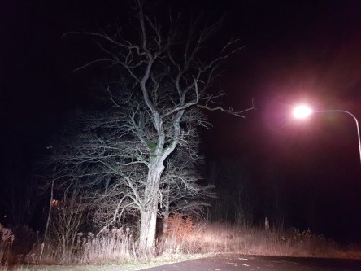

Idag går solen upp 08:04 och ned 15:32. Månen går upp 14:11 och ned 01:40 Månen är belyst 73 %. Dagens längd är 7 timmar och 28 minuter.

 Mest molnigt 3,9 C  Vindby 3 m/s E  Luftfuktighet 85 %  hPa 993 Kl.02:15

 Växlande molnighet 2,7 C  Vindby 2,6 m/s SE  Luftfuktighet 91 %  hPa 994 Kl.06:45

 Molnigt 5,5 C  Vindby 1,6 m/s E   Luftfuktighet 81 %  hPa 997 Kl.14:10

 Mest klart - 2,7 C  Vindby 0,3 m/s NW  Luftfuktighet 91 %  hPa 999 Kl.20:00

 

Högst och lägst uppmätta temperatur igår (inofficiellt privat mätare): Max 6,6 C , Min 3,5 C Högst uppmätta vind 4,4 m/s. Högst uppmätta vindby 6,8 m/s.

Högst och lägst uppmätta temperatur igår (officiellt enligt [YR.NO](http://www.vackertvader.se/v%C3%A4derstation/karlshamn?utm_source=email&utm_medium=email&utm_campaign=asarum)) Max 6,2 C, Min 3,6 C Högst uppmätta vind 3,6 m/s. Högst uppmätta vindby 10 m/s

 

 Mörkt och grått hela dagen. På kvällen har det klarnat upp och blivit kallare,
