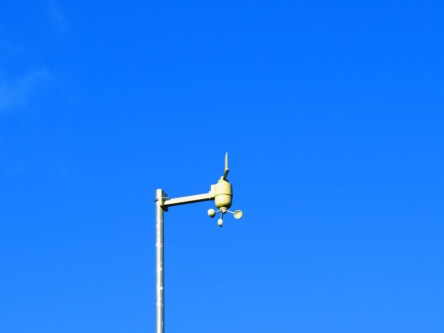

Idag går solen upp 07:02 och ned 16:24. Månen går upp 15:05 och ned 00:18 Månen är belyst 70 %. Dagens längd är 9 timmar och 22 minuter.

 Klart 0,4 C  Vindby 3 m/s SSE  Luftfuktighet 66 %  hPa 1000 Kl.01:35

 Klart - 0,3 C  Vindby 2,2 m/s SW  Luftfuktighet 63 %  hPa 1003 Kl.06:20

 Blåsigt och soligt 9,1 C  Vindby 7,4 m/s W  Luftfuktighet 41 %  hPa 1009 Kl.13:35

 Klart - 3,6 C  Vindstilla  Luftfuktighet 74 %  hPa 1013 Kl.20:00

 

Högst och lägst uppmätta temperatur igår (inofficiellt privat mätare): Max 10 C , Min 2,8 C Högst uppmätta vind 4,1 m/s. Högst uppmätta vindby 8,8 m/s.

Högst och lägst uppmätta temperatur igår (officiellt enligt [YR.NO](http://www.vackertvader.se/v%C3%A4derstation/karlshamn?utm_source=email&utm_medium=email&utm_campaign=asarum)) Max 7,3 C, Min 3,7 C Högst uppmätta vind 6,1 m/s. Högst uppmätta vindby 17,9 m/s

 

 Blå himmel, vita moln och blåsigt hela dagen.

Spara

Spara

Spara
