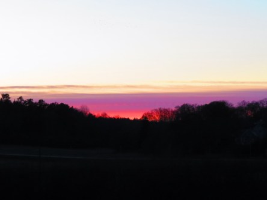

Idag går solen upp 08:12 och ned 15:28. Månen går upp 16:46 och ned 08:34 Månen är belyst 100 %. Dagens längd är 7 timmar och 16 minuter.

 Klart - 2,1 C  Vindby 0,6 m/s E  Luftfuktighet 99 %  hPa 1005 Kl.02:25

 Klart - 3,2 C  Vindby 1 m/s SW  Luftfuktighet 99 %  hPa 1007 Kl.06:50

 Klart 4,6 C  Vindby 2 m/s SE  Luftfuktighet 65 %  hPa 1011 Kl.14:10

 Klart - 4,4 C  Vindstilla  Luftfuktighet 86 %  hPa 1013 Kl.19:50

 

 

Högst och lägst uppmätta temperatur igår (inofficiellt privat mätare): Max 4,7 C , Min – 0,4 C Högst uppmätta vind 3,1 m/s. Högst uppmätta vindby 6,5 m/s.

Högst och lägst uppmätta temperatur igår (officiellt enligt [YR.NO](http://www.vackertvader.se/v%C3%A4derstation/karlshamn?utm_source=email&utm_medium=email&utm_campaign=asarum)) Max ? C, Min ? C Högst uppmätta vind ? m/s. Högst uppmätta vindby ? m/s

 

 Efter en klar och kall dag gick solen ner idag också.
