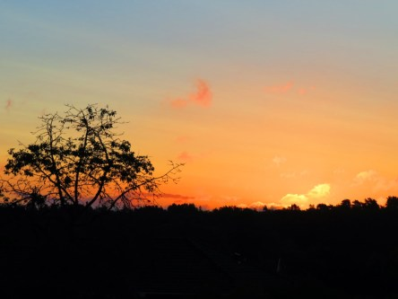

Idag går solen upp 05:10 och ned 21:01. Månen går upp 19:34 och ned 02:49 Månen är belyst 93 %. Dagens längd är 15 timmar och 51 minuter.

 Växlande molnighet  13,2 C  Vindby 2,7 m/s NE  Luftfuktighet 92 %  hPa 999 Kl.02:10

 Växlande molnighet 14,8 C  Vindby 3 m/s E  Luftfuktighet 88 %  hPa 1000 Kl.06:55

 Växlande molnighet 23,3 C  Vindby 3 m/s N  Luftfuktighet 78 %  hPa 1003  Regn 1 mm Kl.15:00

 Mest molnigt 16 C  Vindby 0,3 m/s NW  Luftfuktighet 77 %  hPa 1004 Kl.20:25

 

Högst och lägst uppmätta temperatur igår (inofficiellt privat mätare): Max 22,6 C , Min 13,8 C Högst uppmätta vind 4,1 m/s. Högst uppmätta vindby 6,8 m/s.

Högst och lägst uppmätta temperatur igår (officiellt enligt [YR.NO](http://www.vackertvader.se/v%C3%A4derstation/karlshamn?utm_source=email&utm_medium=email&utm_campaign=asarum)) Max 21,8 C, Min 14,3 C Högst uppmätta vind 2,8 m/s. Högst uppmätta vindby 8,2 m/s

 

Spara

Spara

Spara

Spara

Spara

Spara
