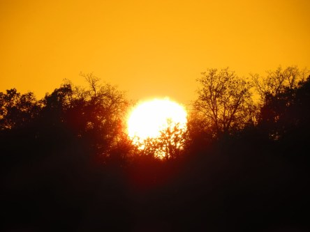
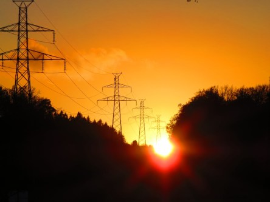

Idag går solen upp 07:20 och ned 16:07. Månen går upp 19:02 och ned 10:58 Månen är belyst 89 %. Dagens längd är 8 timmar och 47 minuter.

 Klart - 3,3 C  Vindstilla  Luftfuktighet 96 %  hPa 1021 Kl.01:15

 Klart - 4,6 C  Vindstilla  Luftfuktighet 93 %  hPa 1022 Kl.06:30

 Mest klart 12,7 C  Vindby 0,8 m/s SE  Luftfuktighet 62 %  hPa 1023 Kl.14:00

 Mest klart - 2,1 C  Vindstilla  Luftfuktighet 95 %  hPa 1022 Kl.21:20

 

Högst och lägst uppmätta temperatur igår (inofficiellt privat mätare): Max 14,4 C , Min - 3,1 C Högst uppmätta vind 3,1 m/s. Högst uppmätta vindby 4,1 m/s.

Högst och lägst uppmätta temperatur igår (officiellt enligt [YR.NO](http://www.vackertvader.se/v%C3%A4derstation/karlshamn?utm_source=email&utm_medium=email&utm_campaign=asarum)) Max 9,1 C, Min - 2,5 C Högst uppmätta vind 2,8 m/s. Högst uppmätta vindby 7 m/s

 

 Det går snabbt när solen går ner och ibland är det svårt att hitta en bra plats för foto. Idag hann jag ifatt den och fick några bra bilder.

Spara

Spara

Spara

Spara

Spara
