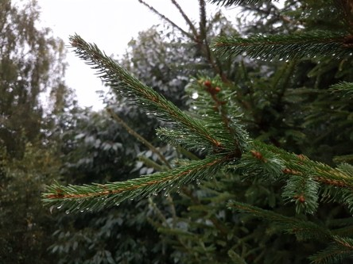

Idag går solen upp 06:17 och ned 19:38. Månen går upp 20:42 och ned 08:38 Månen är belyst 96 %. Dagens längd är 13 timmar och 21 minuter.

 Molnigt 10,7 C  Vindby 1 m/s SSE  Luftfuktighet 98 %  hPa 1001 Kl.02:05

 Molnigt 11,3 C  Vindstilla  Luftfuktighet 98 %  hPa 998  Regn 2 mm Kl.07:05

 Molnigt 17,1 C  Vindby 2 m/s E  Luftfuktighet 92 %  hPa 996 Kl.13:35

 Regn 14,2 C  Vindby 4,4 m/s ENE  Luftfuktighet 99 %  hPa 992  Regn 9,2 mm Kl.20:00

 

Högst och lägst uppmätta temperatur igår (inofficiellt privat mätare): Max 20 C , Min 10,9 C Högst uppmätta vind 1,7 m/s. Högst uppmätta vindby 4,8 m/s.

Högst och lägst uppmätta temperatur igår (officiellt enligt [YR.NO](http://www.vackertvader.se/v%C3%A4derstation/karlshamn?utm_source=email&utm_medium=email&utm_campaign=asarum)) Max 15,4 C, Min 10,6 C Högst uppmätta vind 2 m/s. Högst uppmätta vindby 5,1 m/s

 

Spara

Spara

Spara

Spara

Spara
