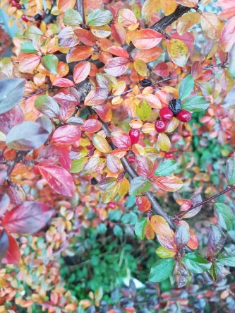

Idag går solen upp 07:24 och ned 16:03. Månen går upp 21:16 och ned 12:49 Månen är belyst 70 %. Dagens längd är 8 timmar och 39 minuter.

 Molnigt 4,8 C  Vindstilla  Luftfuktighet 97 %  hPa 1017 Kl.01:40

 Molnigt 4,8 C  Vindby 0,3 m/s SW  Luftfuktighet 99 %  hPa 1014 Kl.07:05

 Molnigt och disigt 8,4 C  Vindby 2,7 m/s S  Luftfuktighet 78 %  hPa 1009 KL.14:00

 Duggregn 6,6 C  Vindby 2,7 m/s SW  Luftfuktighet 97 %  hPa 1005  Regn 1 mm Kl.20:00

 

Högst och lägst uppmätta temperatur igår (inofficiellt privat mätare): Max 9,9 C , Min – 1,1 C Högst uppmätta vind 1,4 m/s. Högst uppmätta vindby 2 m/s.

Högst och lägst uppmätta temperatur igår (officiellt enligt [YR.NO](http://www.vackertvader.se/v%C3%A4derstation/karlshamn?utm_source=email&utm_medium=email&utm_campaign=asarum)) Max 8,9 C, Min – 2,3 C Högst uppmätta vind 3,2 m/s. Högst uppmätta vindby 5,4 m/s

 

 Idag lyste solen bara med sin frånvaro, så dessa höstfärger får lysa upp istället.

Spara

Spara

Spara

Spara

Spara

Spara
