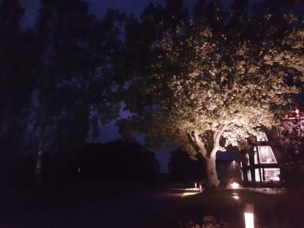

Idag går solen upp 06:19 och ned 19:35. Månen går upp 21:04 och ned 09:57 Månen är belyst 91 %. Dagens längd är 13 timmar och 16 minuter.

 Regn 13,7 C  Vindby 0,8 m/s NE  Luftfuktighet 99 %  hPa 991  Regn 1,2 mm Kl.02:15

 Regnskurar  13,9 C  Vindby 1 m/s NNW  Luftfuktighet 99 %  hPa 990  Regn 2,7 mm Kl.06:50

 Regn 15,5 C  Vindby 2,8 m/s N  Luftfuktighet 94 %  hPa 997  Regn 3,2 mm Kl.13:45

 Molnigt 15 C  Vindby 5,4 m/s NW  Luftfuktighet 99 %  hPa 990  Regn 10 mm Kl.19:45

 

Högst och lägst uppmätta temperatur igår (inofficiellt privat mätare): Max 16,9 C , Min 10,7 C Högst uppmätta vind 2,7 m/s. Högst uppmätta vindby 4,8 m/s.

Högst och lägst uppmätta temperatur igår (officiellt enligt [YR.NO](http://www.vackertvader.se/v%C3%A4derstation/karlshamn?utm_source=email&utm_medium=email&utm_campaign=asarum)) Max 15,2 C, Min 10,6 C Högst uppmätta vind 2,4 m/s. Högst uppmätta vindby 6,6 m/s

 

 Hösten kommer närmare och närmare. Det blir mörkare och mörkare på morgnarna.

Spara

Spara

Spara
