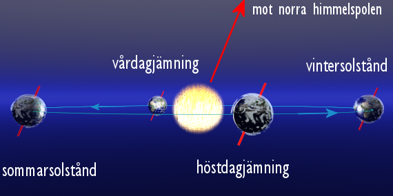
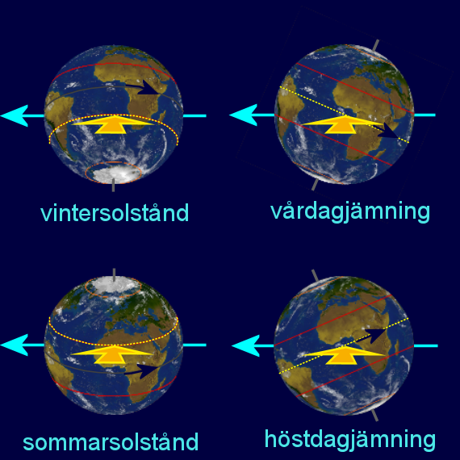
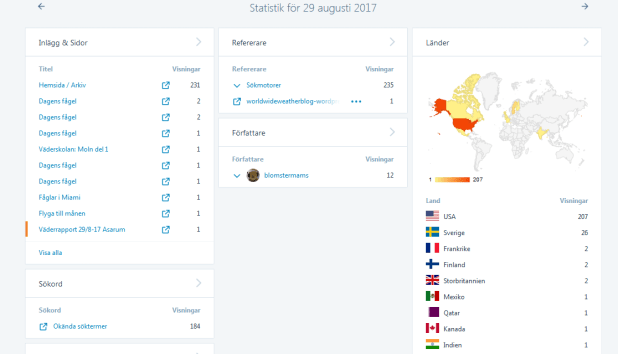

**Idag är det vårdagjämning.**

 _Jordens positioner på dess omloppsbana vid vårdagjämning, sommarsolstånd,_ _höstdagjämning och vintersolstånd_.

 _Jorden sedd från solen vid vinter- och sommarsolstånd, samt vårdag- och_ _höstdagjämning_.

_För den som vill veta mer om vårdagjämningen så kan ni se det [här](http://www.svt.se/vader/fragor_och_svar/vardagjamningen-ar-har)._
