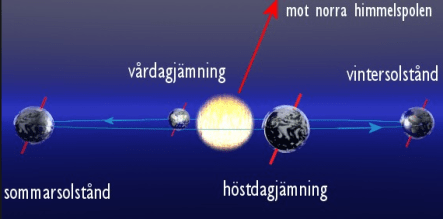
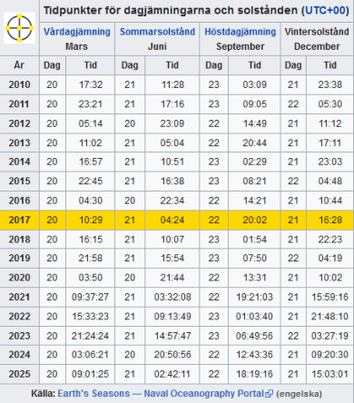

**Vintersolståndet 2017**

_I år inträffar årets kortaste dag, vintersolståndet, torsdagen den 21/12 kl.16:28. Sen blir det sakta ljusare för var dag som går._

_Bilden är hämtad från Astroinfo.se och mer i ämnat kan ni läsa [här](http://www.astroinfo.se/articles/268/vintersolstandet-2015) på deras sida. Nedan ser ni tider för dagjämningarna och solstånden de kommande åren och för åren som gått._

