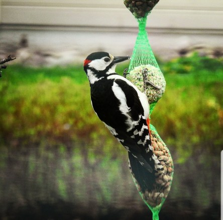

Idag går solen upp 05:33 och ned 20:25. Månen går upp 13:10 och ned 03:58 Månen är belyst 63 %. Dagens längd är 14 timmar och 52 minuter

 Växlande molnighet 8,1 C  Vindby 2,4 m/s SW  Luftfuktighet 80 %  hPa 1003 Kl.02:30

 Molnigt 8 C   Vindby 2,8 m/s S  Luftfuktighet 85 %  hPa 1002 Kl.07:20

 Molnigt 12,2 C  Vindby 5,1 m/s W  Luftfuktighet 87 %  hPa 999 Kl.14:00

 Växlande molnighet och blåsigt 8,1 C  Vindby 7,1 m/s NW  Luftfuktighet 65 %  hPa 1000 Kl.20:55

 Idag har det varit kallt, blåsigt och riktigt ruggigt.

Högst och lägst uppmätta temperatur igår (inofficiellt privat mätare): Max 19,2 C , Min 0,5 C Högst uppmätta vind 3,1 m/s. Högst uppmätta vindby 5,1 m/s.

Högst och lägst uppmätta temperatur igår (officiellt enligt [YR.NO](http://www.vackertvader.se/v%C3%A4derstation/karlshamn?utm_source=email&utm_medium=email&utm_campaign=asarum)) Max 16,9 C, Min 0,2 C Högst uppmätta vind 4,5 m/s. Högst uppmätta vindby 9,3 m/s

 Pappa Hacke på besök i trädgården.
