**En andningspaus mitt i storstadsstressen**

_Nu fortsätter vi vår promenad i "djungeln" mitt i New York. Det tog ett tag innan vi hittade ut ur labyrinten som vi hamnade i, men till slut så var vi tillbaka i civilisationen igen._

[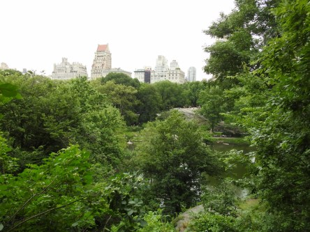](https://worldwideweatherblog.wordpress.com/wp-content/uploads/2018/07/dscn6764-1600x1200.jpg) _Storstadsdjungel, bokstavligen._

[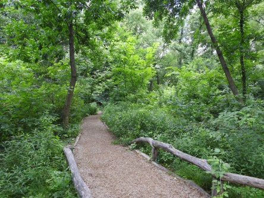](https://worldwideweatherblog.wordpress.com/wp-content/uploads/2018/07/dscn6766-1600x1200.jpg) _Vägen ut till civilisationen._

[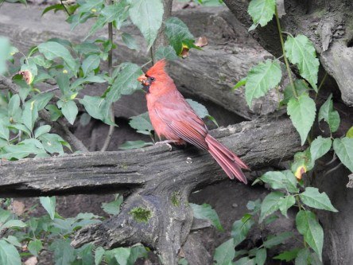](https://worldwideweatherblog.wordpress.com/wp-content/uploads/2018/07/dscn2050-1600x1200.jpg) _Här stötte vi på herr Kardinal._

[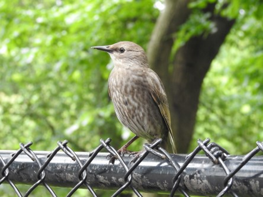](https://worldwideweatherblog.wordpress.com/wp-content/uploads/2018/07/dscn6789-1600x1200.jpg)

 _En ung stare som undrar varför vi inte bara flög ut._

 _Matkö._

[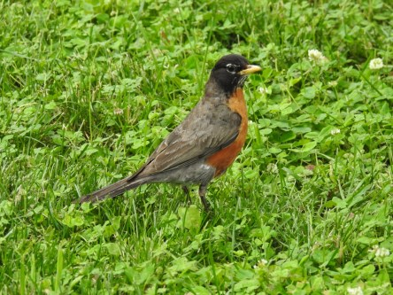](https://worldwideweatherblog.wordpress.com/wp-content/uploads/2018/07/dscn6805-1600x1200.jpg) _Ännu en vandringstrast poserar snällt._

 _Även den lilla ungen står snällt stilla och låter oss ta några bilder._

[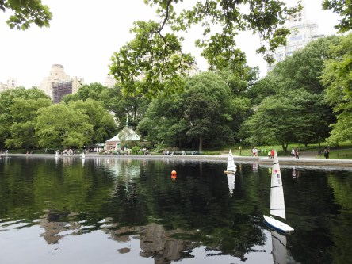](https://worldwideweatherblog.wordpress.com/wp-content/uploads/2018/07/dscn6832-1600x1200.jpg) _Här kan man hyra radiostyrda segelbåtar och tävla om man vill._

[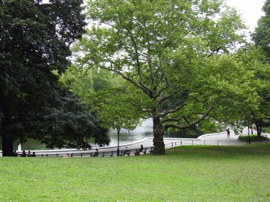](https://worldwideweatherblog.wordpress.com/wp-content/uploads/2018/07/dscn6849-1600x1200.jpg) _Vi vandrar vidare i parken._

[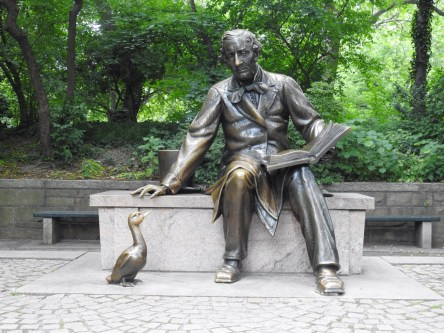](https://worldwideweatherblog.wordpress.com/wp-content/uploads/2018/07/dscn6870-1600x1200.jpg) _Här stöter vi på H.C Andersen._

 _Och Alice i underlandet. Det var inte lätt att få en bild utan folk på den här eftersom både barn och vuxna använde den till klätterställning. Men det är ju en saga så klart man ska leka då._

 _Efter att vi tagit dessa bilder så vandrar vi vidare mot nya mål._

[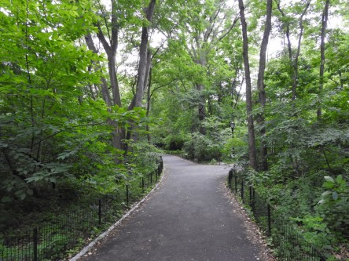](https://worldwideweatherblog.wordpress.com/wp-content/uploads/2018/07/dscn6902-1600x1200.jpg) _Frågan är, vilket håll ska vi gå?. Det fick bli rakt fram._

 _Här sprang vi på herr Kardinal igen. Och den här herren är inte särskilt lätt att få bra bilder på för han har ingen lust att sitta still någon längre stund. Men han är verkligen snygg._

[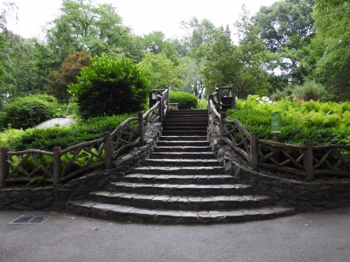](https://worldwideweatherblog.wordpress.com/wp-content/uploads/2018/07/dscn6927-1600x1200.jpg) _Nu ska vi gå upp och titta på vackra blommor._

[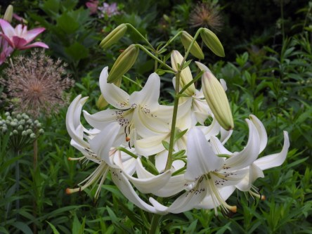](https://worldwideweatherblog.wordpress.com/wp-content/uploads/2018/07/dscn6936-1600x1200.jpg)

[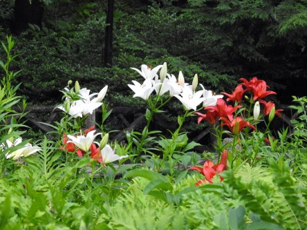](https://worldwideweatherblog.wordpress.com/wp-content/uploads/2018/07/dscn6937-1600x1200.jpg) _Massor av vackra liljor._

 _Och änglatrumpeter._

[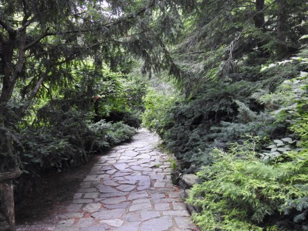](https://worldwideweatherblog.wordpress.com/wp-content/uploads/2018/07/dscn6939-1600x1200.jpg) _Sedan går färden vidare genom grönskan._

 _En kanske inte helt önskvärd figur möter oss här. Men han är rätt söt tycker jag._

[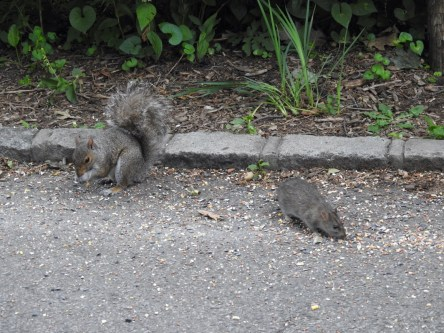](https://worldwideweatherblog.wordpress.com/wp-content/uploads/2018/07/dscn6951-1600x1200.jpg)

[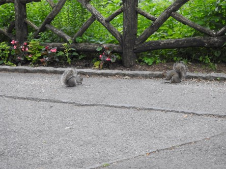](https://worldwideweatherblog.wordpress.com/wp-content/uploads/2018/07/dscn6963-1600x1200.jpg)

 _Det är hård konkurrens om maten här. Ekorrarna vill ha sitt med._

[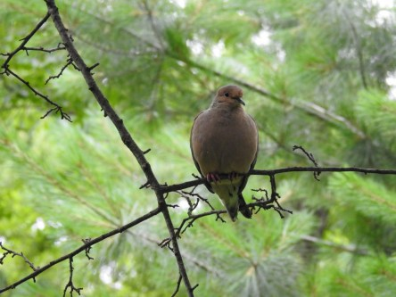](https://worldwideweatherblog.wordpress.com/wp-content/uploads/2018/07/dscn6984-1600x1200.jpg)

[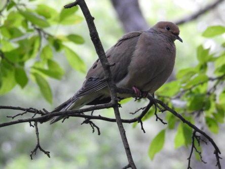](https://worldwideweatherblog.wordpress.com/wp-content/uploads/2018/07/dscn6988-1600x1200.jpg) _Duvan har allt under kontroll känns det som._

[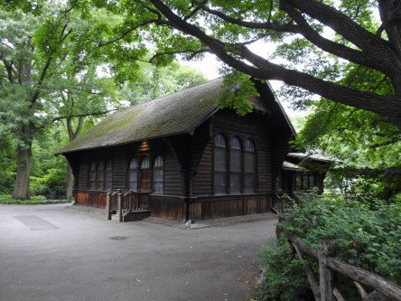](https://worldwideweatherblog.wordpress.com/wp-content/uploads/2018/07/dscn6990-1600x1200.jpg)

 _Och lite svenskt måste vi ju ha med också!_

[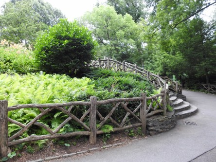](https://worldwideweatherblog.wordpress.com/wp-content/uploads/2018/07/dscn6993-1600x1200.jpg) _Nu är vi ganska trötta efter att ha vandrat omkring här nästan hela dagen, så nu är det raka spåret hem till hotellet som gäller._
