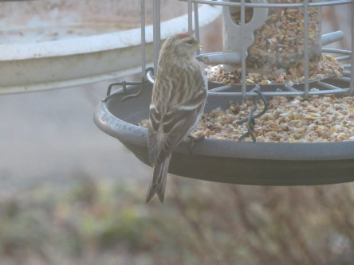
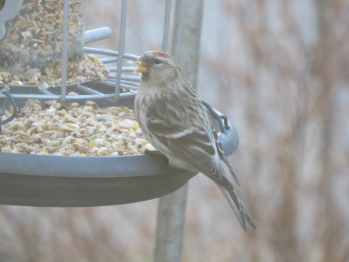
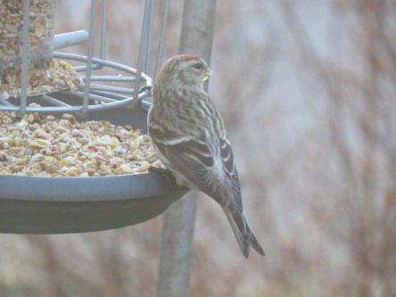
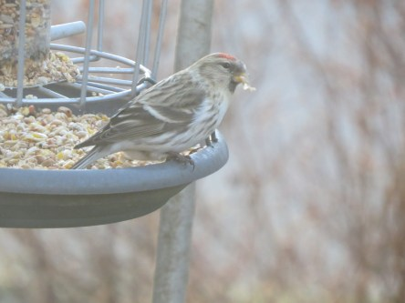
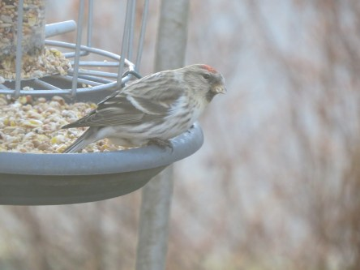
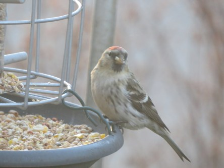
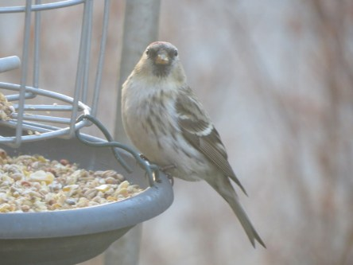
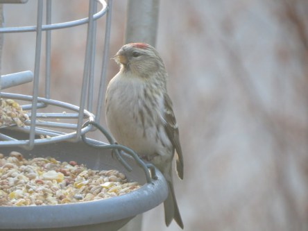

**Fint besök i trädgården**

_Idag fick jag besök av en gråsiska i trädgården och vad jag vet är det första gången jag ser den här. Därmed var dagen räddad, efter alla gråa tråkiga dagar blev det både sol och ny fågel!_

 

 _Bilderna är tagna genom ett allt annat än rent köksfönster, så det är ingen HD kvalitet direkt. Men jag är jättenöjd med dem ändå._
