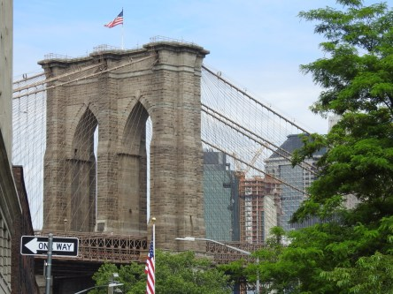
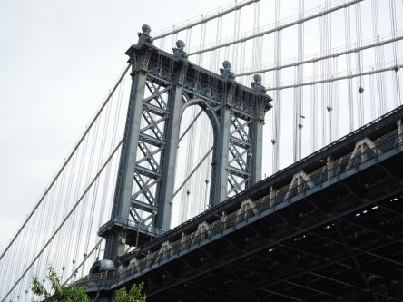
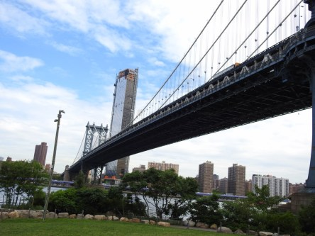
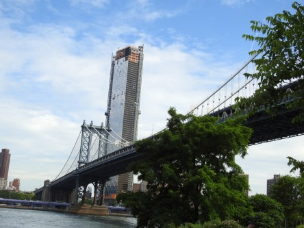
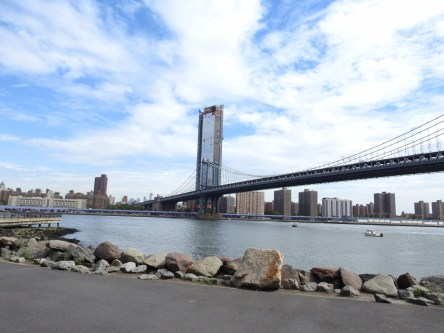
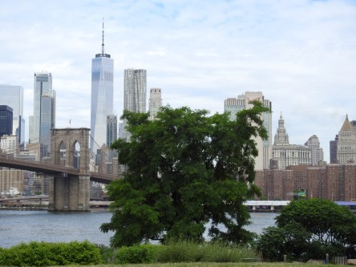
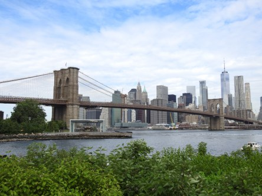
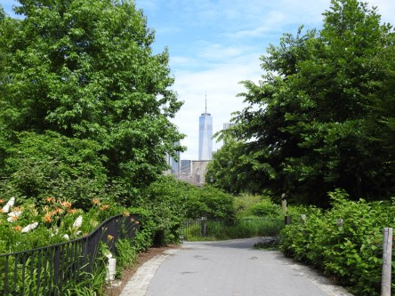
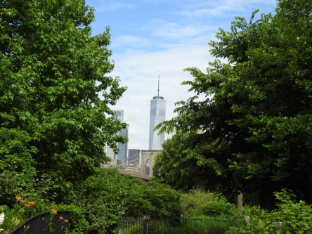
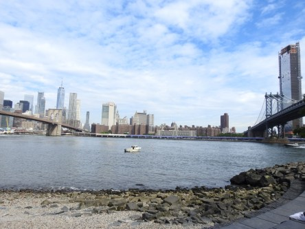

**Berömda broar.**

_Som den hängivna brofanatiker jag är så blev det massor av bilder på de två världsberömda broarna Manhattan Bridge och Brooklyn Bridge och dess omgivning. Här är en del av alla dessa bilder. Det blir ganska många eftersom jag har svårt att välja bland dem._

 _Första bilden på Brooklyn Bridge_

 _Några bilder på Manhattan Bridge._

 _Och sedan lite bilder på Brooklyn Bridge._

 _Det är en härlig park att vandra i mellan broarna. På den nedersta bilden ser man båda broarna. Manhattan till höger och Brooklyn till vänster._
