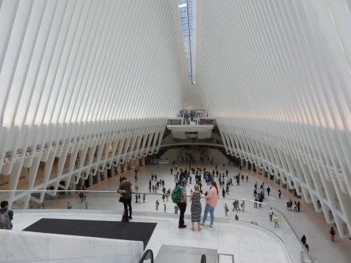
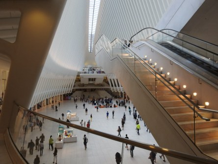
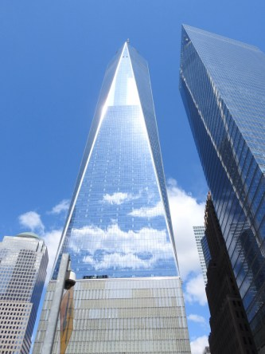
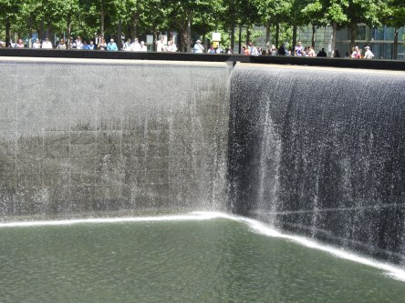
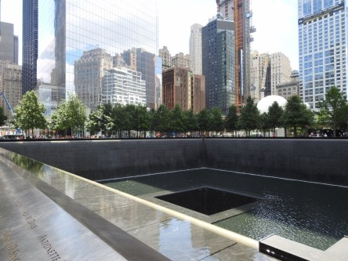
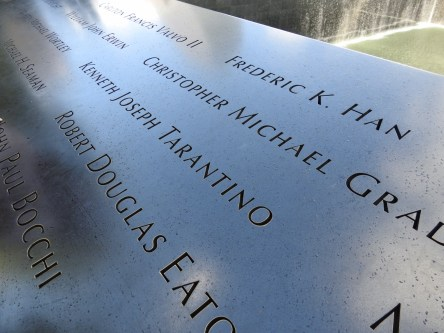
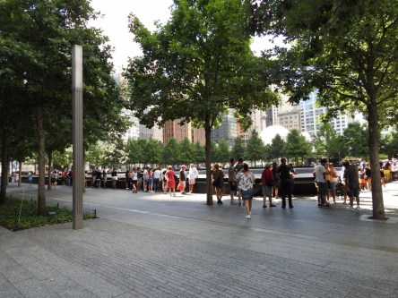
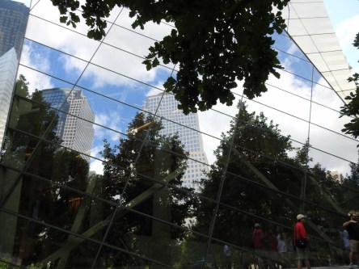
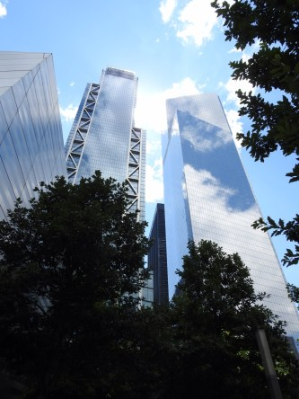

**Ground Zero memorial**

_Även den här gången besökte vi minnesplatsen vid Ground Zero där tvillingtornen en gång stod. När man går runt och tittar på alla namn som är ingraverade vid fontänerna som byggts där tornen stod så förstår man lite av omfattningen av katastrofen den 11 September 2001. Och ändå är det svårt att fatta att alla dessa namn är människor som fick sätta livet till i denna vansinniga attack som ägde rum då. Ondskan och grymheten i detta dåd är ofattbar. Och fortfarande finns det oidentifierade offer för attacken. Det saknas många namn som de troligtvis aldrig lär få fram. För amerikanarna är detta helig mark och man bygger inget som går ovan mark. Det är därför som vattenfontänerna går ner under jorden. Här är lite bilder på hur det ser ut där idag._

 _Vi börjar med att besöka Oculus som är världens dyraste tågstation. Den ligger alldeles bredvid minnesmonumenten för tornen._

 _Därefter tar vi lite bilder på det nya tornet, One World Trade Center. Det är väldigt vackert och molnen speglar sig i toppen på byggnaden._

 _Sen går vi vidare för att se minnesmonumenten där tornen en gång stod._

 _Här ser man en del av alla namn som är ingraverade på kanten av monumentet._

 _Lite av omgivningen runt omkring med spegelblanka sky- skrapor._
