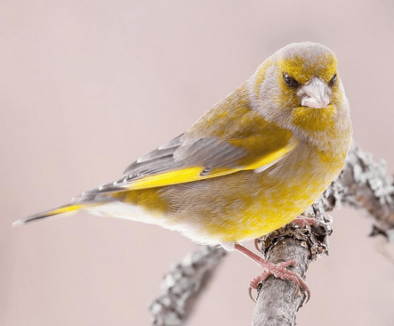
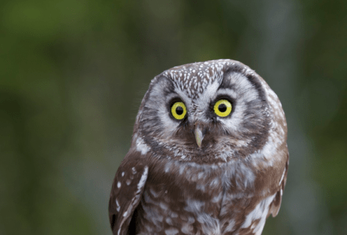

**Deltävlingar i fågelmelodifestivalen 2018**

_Lyssna och välj din favorit till finalen. I deltävling tre finns det fortfarande möjlighet att rösta._

[Deltävling 1](http://www.natursidan.se/nyheter/rosta-i-fagelmelodifestivalen-2018-deltavling-1/) [Vinnare](http://www.natursidan.se/nyheter/vinnarna-i-fagelmelodifestivalen-2018-deltavling-1/) [Deltävling 2](http://www.natursidan.se/nyheter/rosta-i-fagelmelodifestivalen-2018-deltavling-2/) [Vinnare](http://www.natursidan.se/nyheter/vinnarna-i-fagelmelodifestivalen-2018-deltavling-2/) [Deltävling 3](http://www.natursidan.se/nyheter/rosta-i-fagelmelodifestivalen-2018-deltavling-3/)

_Bilder från Natursidan._
