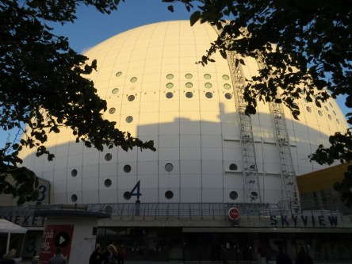
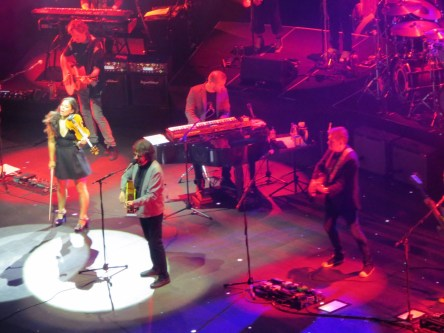
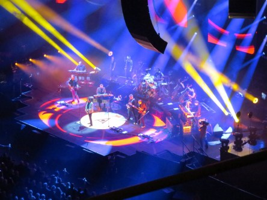
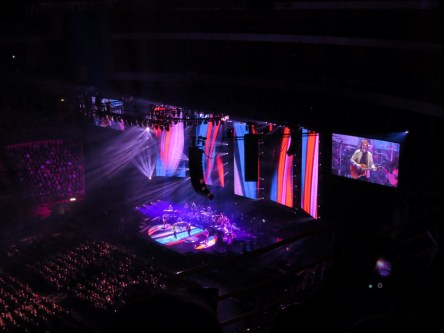
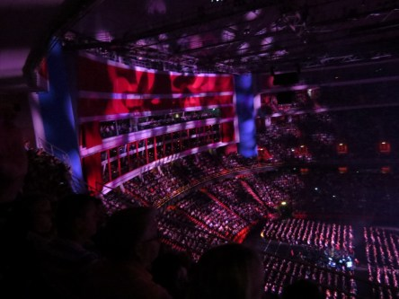
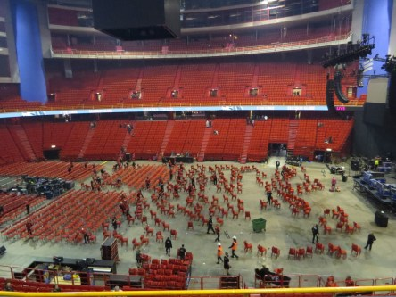
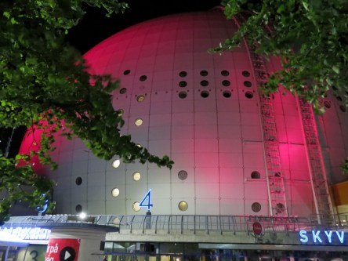
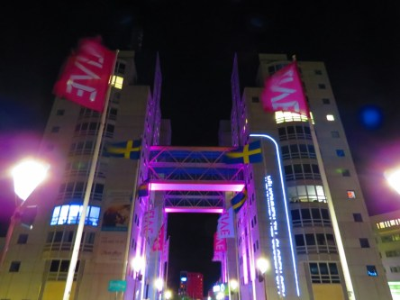

**På konsert med Electric Light Orchestra i Globen Stockholm.**

_I onsdags, den 12/9-18, var vi på konsert i Globen och såg ELO. Det var en helt fantastisk show med massor av gamla ELO klassiker. Vilken upplevelse det blev att få se och höra dem live efter att ha lyssnat på dem i över 35 år. Här är några bilder från före, under och efter showen i Globen._

 _På väg till konsert i Globen._

 _I väntan på ELO._

 _Det blev en konsert som man sent ska glömma. Så mycket nostalgi!_

 _Bara några minuter efter konserten såg det ut så här i arenan. Den tömdes snabbt för att ge plats åt isen för nästa dags hockeymatch._

 _Och när vi kom ut så lyste det så här vackert om Globen!_
