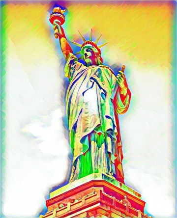

**Färgglatt med app**

_Jag roade mig med att förvandla några av mina bilder med appen Pics Art till färgglada tavlor. Jag använde samma effekt till alla bilder._

 _New York_

 _London_

 _Paris_

 _Pisa_

 _Rom_

 _Och sist men inte minst Dubai_
