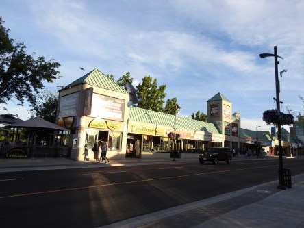
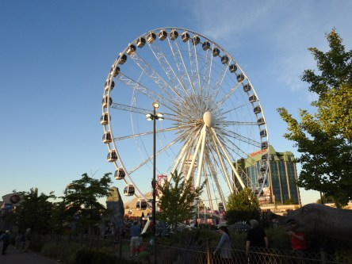
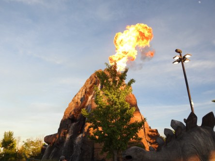
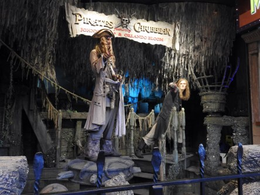
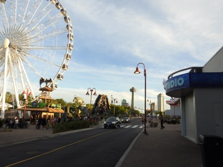
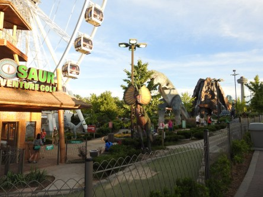

**Clifton Hill vid Niagarafallen**

_Vid Niagarafallen ligger ett litet mini Las Vegas som heter Clifton  Hill. Det finns allt från spelhallar till restauranger med monsterteman och golfbanor med dinosaurier. Det är högljutt och massor av blinkande ljus överallt. Roligt att ströva omkring och uppleva allt som finns där. Här är några bilder därifrån_

