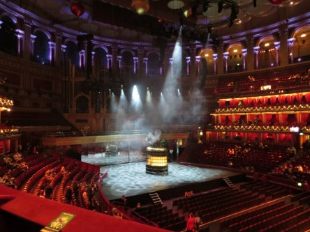
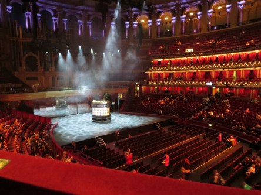
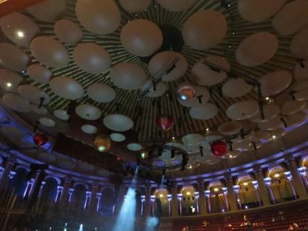
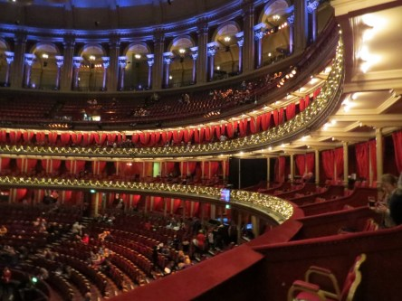
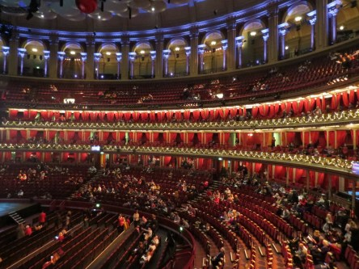
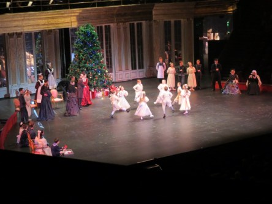
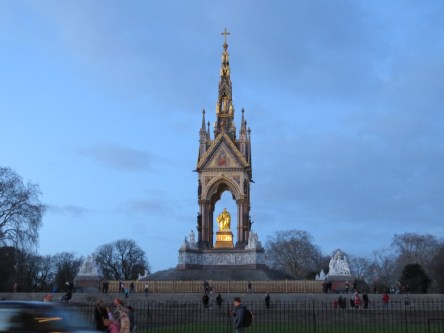
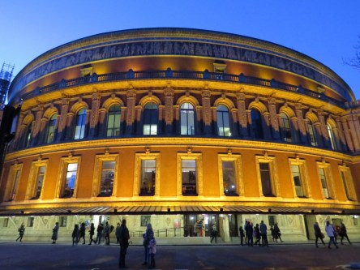
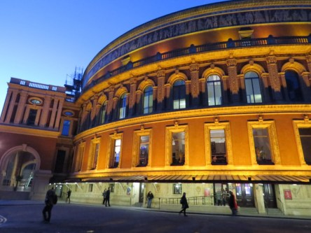
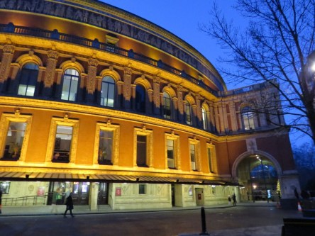

**Nötknäpparen på Royal Albert Hall**

_Vi såg Nötknäpparen på Royal Albert Hall i London. Här är lite bilder från hallen, men tyvärr fick man inte ta bilder under föreställningen så det blir bara en bild på den som jag hann ta innan de påtalade att vi inte fick fotografera._

 _Royal Albert Memorial strax innan vi gick in i hallen._

 _Scenen innan föreställningen började._

 _Det berömda taket i hallen._

 _Hallen sett från vår bås._

 _I början på föreställningen._

 _Minnesmonumentet efter föreställningen._

 _Hallen i kvällsbelysning._
