**Eilian Donan Castle**

_Trots att jag gjort ett inlägg om det här slottet tidigare så väljer jag att göra ett till i den här serien om vår resa i Skottland. Jag har valt lite andra bilder än i det förra inlägget och hoppas att de ska ge en rättvis bild av detta vackra slott som är ett av Skottlands mest fotograferade slott._

[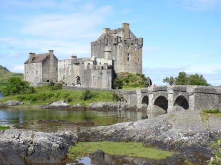](https://worldwideweatherblog.wordpress.com/wp-content/uploads/2018/01/dscn8310-desktop-resolution.jpg)

[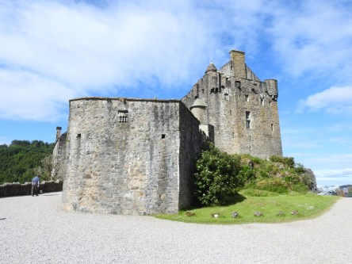](https://worldwideweatherblog.wordpress.com/wp-content/uploads/2018/01/dscn8323-desktop-resolution.jpg)

 _Min son förevigar utsikten från slottet._

[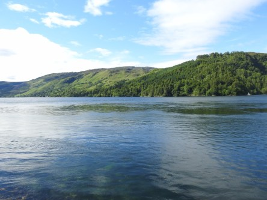](https://worldwideweatherblog.wordpress.com/wp-content/uploads/2018/01/dscn8335-desktop-resolution.jpg) _Och den utsikten är helt fantastisk._

[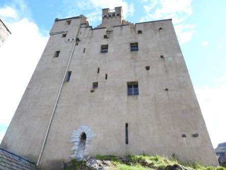](https://worldwideweatherblog.wordpress.com/wp-content/uploads/2018/01/dscn8336-desktop-resolution.jpg)

[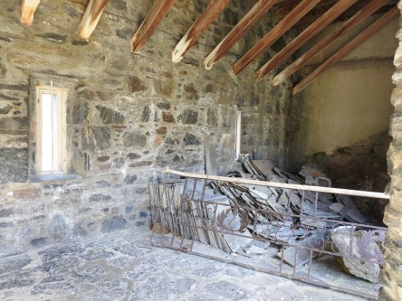](https://worldwideweatherblog.wordpress.com/wp-content/uploads/2018/01/dscn8337-desktop-resolution.jpg) _Det finns många skrymslen och vrår i gamla slott._

 _Ett av alla vackra fönster i slottet._

[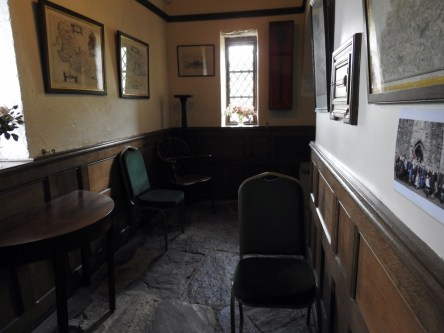](https://worldwideweatherblog.wordpress.com/wp-content/uploads/2018/01/dscn8347-desktop-resolution.jpg)

[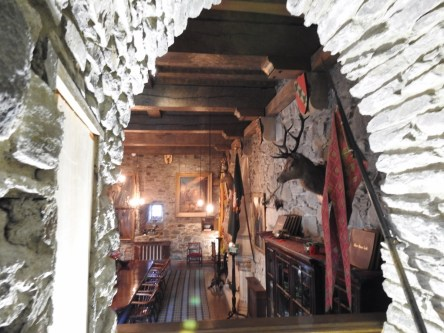](https://worldwideweatherblog.wordpress.com/wp-content/uploads/2018/01/dscn8356-desktop-resolution.jpg) _Det finns hur många rum som hels__t i slottet._

[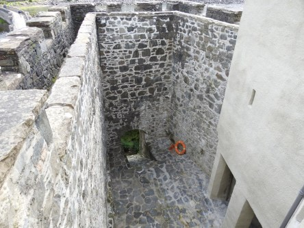](https://worldwideweatherblog.wordpress.com/wp-content/uploads/2018/01/dscn8362-desktop-resolution.jpg)

[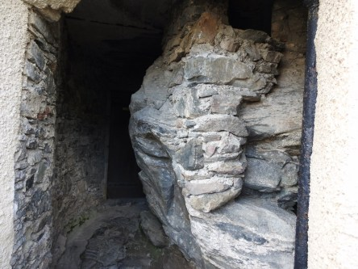](https://worldwideweatherblog.wordpress.com/wp-content/uploads/2018/01/dscn7639-desktop-resolution.jpg)

[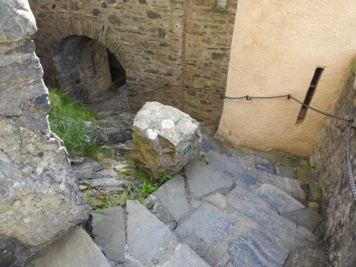](https://worldwideweatherblog.wordpress.com/wp-content/uploads/2018/01/dscn7642-desktop-resolution.jpg)

 _Det gäller att vara smidig om man ska hinna ta sig fram och gömma sig för fienden här._

[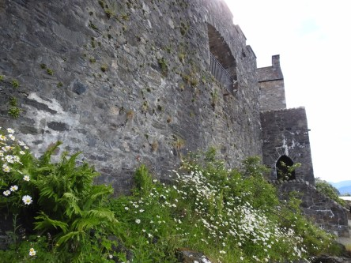](https://worldwideweatherblog.wordpress.com/wp-content/uploads/2018/01/dscn8399-desktop-resolution.jpg)

[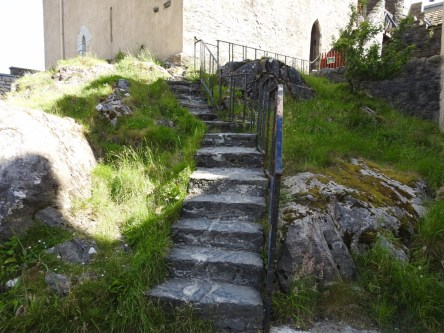](https://worldwideweatherblog.wordpress.com/wp-content/uploads/2018/01/dscn7632-desktop-resolution.jpg)

[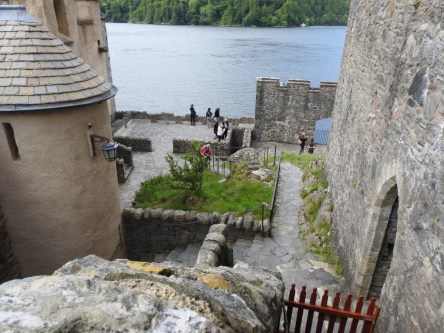](https://worldwideweatherblog.wordpress.com/wp-content/uploads/2018/01/dscn7648-desktop-resolution.jpg)

 _Det blir aldrig långtråkigt att vandra runt här bland smala gångar och titta på utsikten._

 _En sista vy över slottet innan vi åker vidare._

[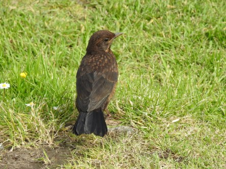](https://worldwideweatherblog.wordpress.com/wp-content/uploads/2018/01/dscn7697-desktop-resolution.jpg) _Den här koltrasten får avsluta vår tur på slottet._

 _Och innan vi åker vidare till Glen Shiel och därefter Loch Ness lyssnar vi på lite säckpipa._

_I nästa del utforskar vi Glen Shiel, Loch Ness och Fort Augustus._
