**Glen Shiel, Loch Ness och Fort Augustus_._**

_Här åker vi vidare mot Loch Ness och stannar till vid Glen Shiel på vägen. Vi byter även guide och fortsätter den andra delen av vår resa med en ny guide och delvis ny grupp. Så här är halva resan slut. Men det återstår mycket mer att se och uppleva på del två._

[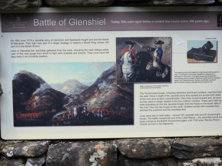](https://worldwideweatherblog.wordpress.com/wp-content/uploads/2018/02/dscn8452-desktop-resolution.jpg) _Nu har vi nått fram till det otroligt vackra [Glen Shiel](https://en.wikipedia.org/wiki/Glen_Shiel)_

[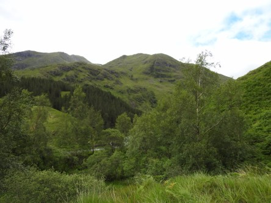](https://worldwideweatherblog.wordpress.com/wp-content/uploads/2018/02/dscn8462-desktop-resolution.jpg)

[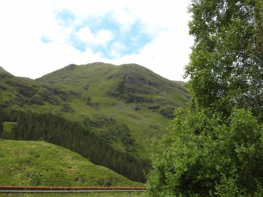](https://worldwideweatherblog.wordpress.com/wp-content/uploads/2018/02/dscn8470-desktop-resolution.jpg)

 _Efter en helt under promenad i dessa omgivningar beger vi oss till nästa stopp som är det mytomspunna Loch Ness!_

[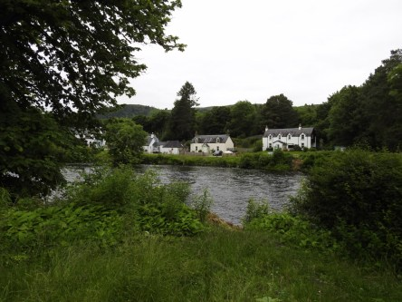](https://worldwideweatherblog.wordpress.com/wp-content/uploads/2018/02/dscn8490-desktop-resolution.jpg) _Här är vi på väg ner till den världsberömda sjön._

[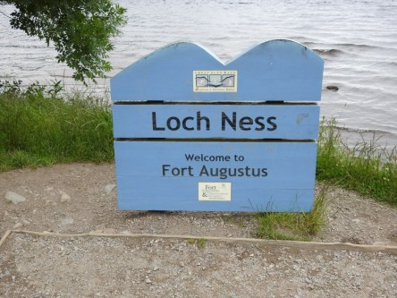](https://worldwideweatherblog.wordpress.com/wp-content/uploads/2018/02/dscn8494-desktop-resolution.jpg) _Och nu är vi framme!_

 _Loch Ness breder ut sig i all sin prakt framför oss._

[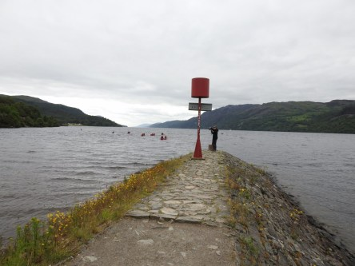](https://worldwideweatherblog.wordpress.com/wp-content/uploads/2018/02/dscn8500-desktop-resolution.jpg) _Det blåste ordentligt så det gällde att hålla i kameran för att få bra bilder. Här kämpar min son Johannes mot vindarna_

[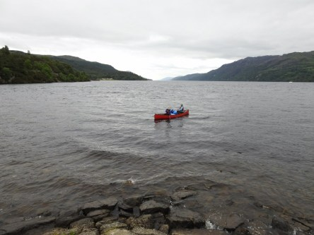](https://worldwideweatherblog.wordpress.com/wp-content/uploads/2018/02/dscn8508-desktop-resolution.jpg) _Trots vädret var det de som antog utmaningen och paddlade kanot på sjön._

[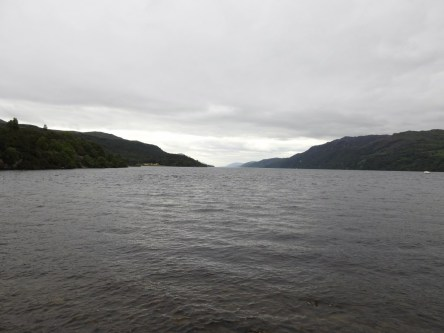](https://worldwideweatherblog.wordpress.com/wp-content/uploads/2018/02/dscn8512-desktop-resolution.jpg) _Nu är det dags att gå tillbaka till Fort Augustus._

 _Här slingrar sig Caledonian Canal._

[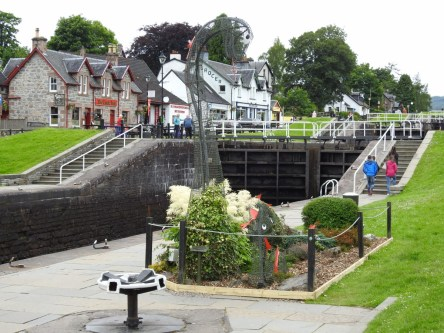](https://worldwideweatherblog.wordpress.com/wp-content/uploads/2018/02/dscn8527-desktop-resolution.jpg)

[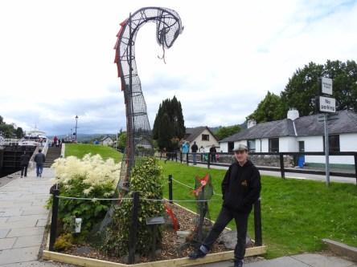](https://worldwideweatherblog.wordpress.com/wp-content/uploads/2018/02/dscn8542-desktop-resolution.jpg) _Det är ingen stor stad men väldigt vacker med sin kanal. Här har Johannes lyckats hitta det berömda monstret 😉_

[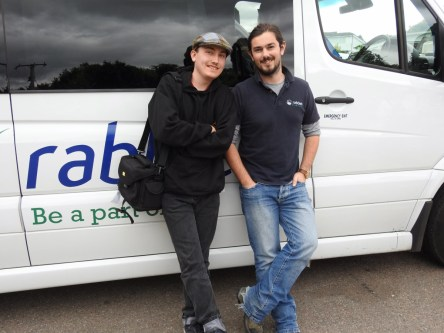](https://worldwideweatherblog.wordpress.com/wp-content/uploads/2018/02/dscn8548-desktop-resolution.jpg) _Nu var det dags att ta farväl av en del av våra kamrater som vi tillbringat den här fantastiska veckan med. Och även att_ _säga tack och hej då till vår charmiga och otroligt duktiga guide Grant._

_I nästa inlägg fortsätter vi vår resa med vår nya guide Audry._
