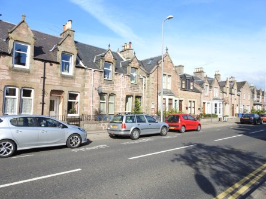
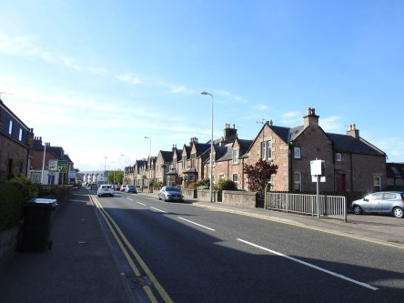
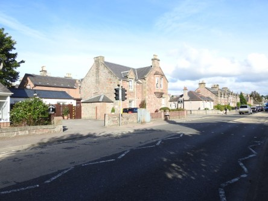
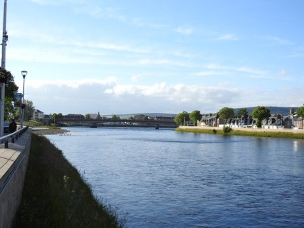
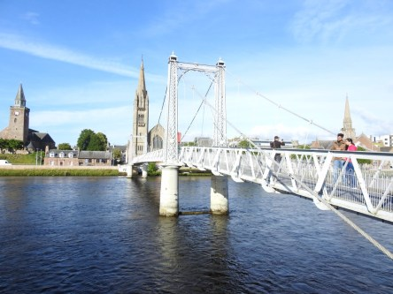
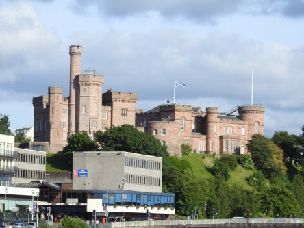
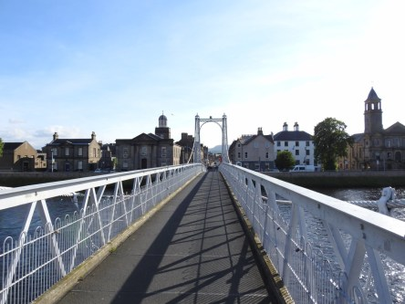

**Inverness**

_Idag går vår resa vidare till Skottländska höglandets huvudstad Inverness. Vi hade turen att få bo hos samma lilla dam som vi bodde hos förra gången vi var här. Det var väldigt roligt att se henne lika pigg och glad som sist, trots att hon inte är någon ungdom längre. Eftersom jag gjort flera inlägg från Inverness tidigare så väljer jag att visa lite mer udda bilder den här gången. Lite mer vardagsbilder från den här mysiga lilla staden._

 _Här är vi på väg in till centrum av Inverness från vårt B&B. Inverness är en ganska liten stad och det är inga problem att gå dit man vill._

\> _Nu har vi kommit fram till [River Ness](https://en.wikipedia.org/wiki/River_Ness) och den berömda gångbron som gungar för varje steg man tar._

 _Här ser man slottet i Inverness från bron._

 _River Ness i all sin glans på kvällen. Det är helt underbart att gå här en sommarkväll. Jag längtar själv tillbaka när jag ser dessa bilder._

 _Den gungiga bron igen. Nu på väg hem till vårt B&B._

 ___En typisk gata i Inverness._

_I nästa inlägg går färden vidare mot Dunrobin Castle och sedan tar vi båten över till det helt otroliga Orkney._
