**På väg till Orkney**

_Nu är vi äntligen på väg mot det mest spännande på vår resa genom Skottland,till Orkneyöarna. Vi gör en del stopp på vägen vid bland annat Dunrobin Castle och Helmsdale med sitt utvandrarmonument. Sen stannar vi till vid Dunbeath där vi ser slottet som riskerar att sjunka ner i havet. Därefter går färden till färjan som ska ta oss över till Orkney._

[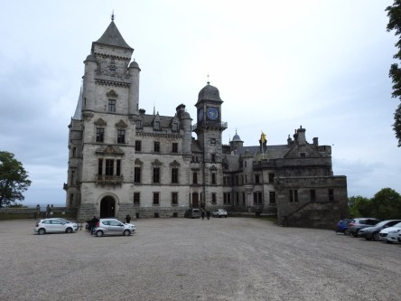](https://worldwideweatherblog.wordpress.com/wp-content/uploads/2018/04/dscn8720-desktop-resolution.jpg)

[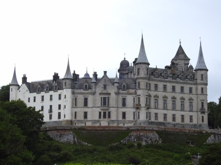](https://worldwideweatherblog.wordpress.com/wp-content/uploads/2018/04/dscn8743-desktop-resolution.jpg)

[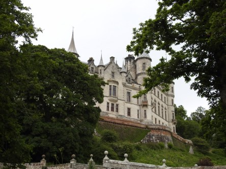](https://worldwideweatherblog.wordpress.com/wp-content/uploads/2018/04/dscn8725-desktop-resolution.jpg)

[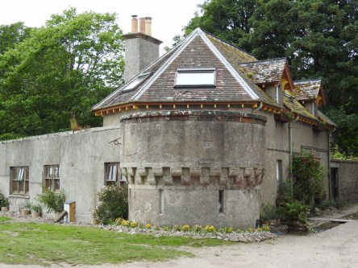](https://worldwideweatherblog.wordpress.com/wp-content/uploads/2018/04/dscn8745-desktop-resolution.jpg)

 _Här är vi vid Dunrobin Castle och dess omgivning nere vid havet. Det blåste enormt mycket här så det var svårt att hålla kameran stilla. Det är inget för den som vill ha sol och värme här._

[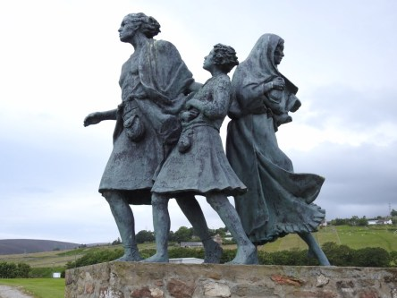](https://worldwideweatherblog.wordpress.com/wp-content/uploads/2018/04/dscn8761-desktop-resolution.jpg)

[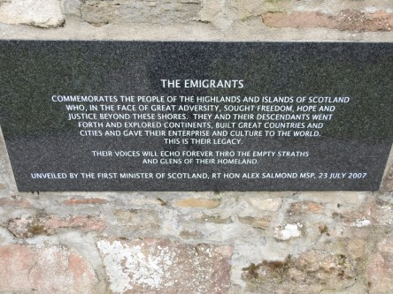](https://worldwideweatherblog.wordpress.com/wp-content/uploads/2018/04/dscn8764-desktop-resolution.jpg)

[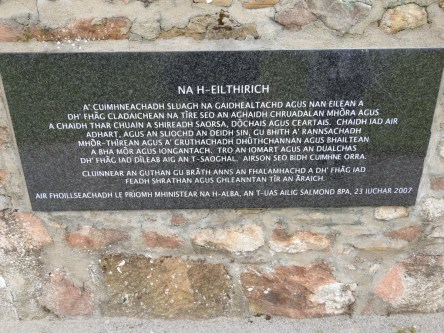](https://worldwideweatherblog.wordpress.com/wp-content/uploads/2018/04/dscn8768-desktop-resolution.jpg) _Nu är vi framme vid Skottlands utvandrarmonument: The Emigrants. På tavlan kan du läsa om detta monument och om du föredrar att läsa på gaeliska så är det den nedersta bilden som gäller._

[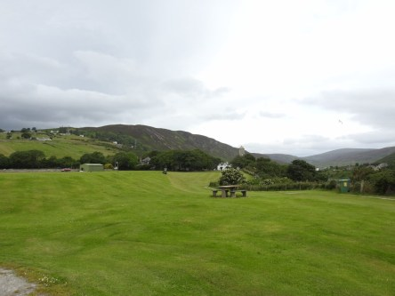](https://worldwideweatherblog.wordpress.com/wp-content/uploads/2018/04/dscn8769-desktop-resolution.jpg)

[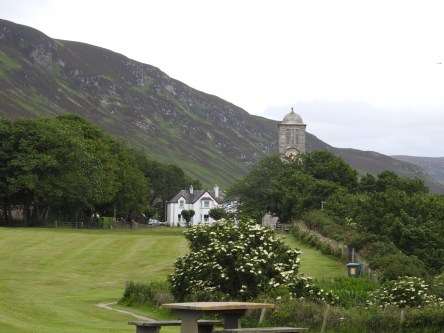](https://worldwideweatherblog.wordpress.com/wp-content/uploads/2018/04/dscn8771-desktop-resolution.jpg)

 _Omgivningen kring The Emigrants._

 _Här visas vad som är attraktioner i Helmsdale._

[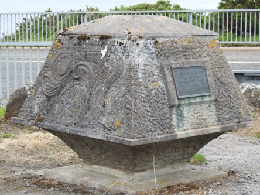](https://worldwideweatherblog.wordpress.com/wp-content/uploads/2018/04/dscn8777-desktop-resolution.jpg) _En minnessten där Helmsdale Castle en gång stått._

 _Nu går färden vidare mot Dunbeath och nu är vi väldigt långt norrut i Skottland._

[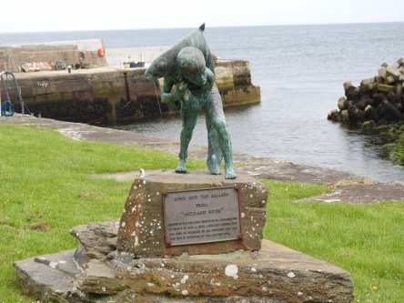](https://worldwideweatherblog.wordpress.com/wp-content/uploads/2018/04/dscn8792-desktop-resolution.jpg) _Ett minnesmonument över Neil M. Gunn. Han var en författare som du kan läsa om [här](https://en.wikipedia.org/wiki/Neil_M._Gunn).

_[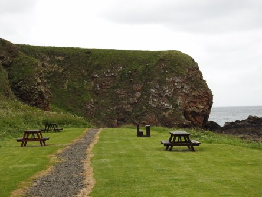](https://worldwideweatherblog.wordpress.com/wp-content/uploads/2018/04/dscn8804-desktop-resolution.jpg)

[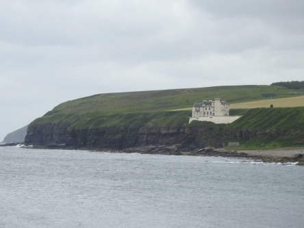](https://worldwideweatherblog.wordpress.com/wp-content/uploads/2018/04/dscn8805-desktop-resolution.jpg)

 _Dunbeath Castle tronar över hamnen._

[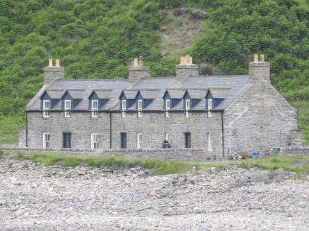](https://worldwideweatherblog.wordpress.com/wp-content/uploads/2018/04/dscn8809-desktop-resolution.jpg)

[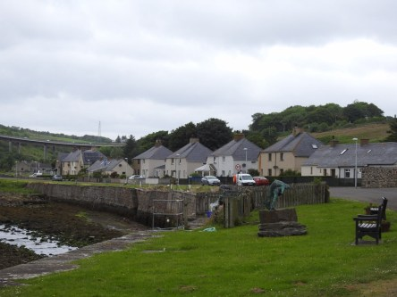](https://worldwideweatherblog.wordpress.com/wp-content/uploads/2018/04/dscn8822-desktop-resolution.jpg) _Några bilder från den lilla byn._

[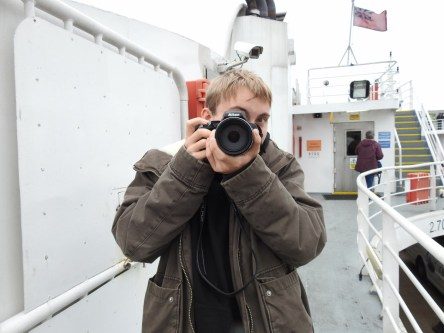](https://worldwideweatherblog.wordpress.com/wp-content/uploads/2018/04/dscn8865-desktop-resolution.jpg) _Nu tar vi ett snabbt kliv över till färjan mot Orkney. Här är min son Johannes redo med sin kamera att föreviga turen över havet._

[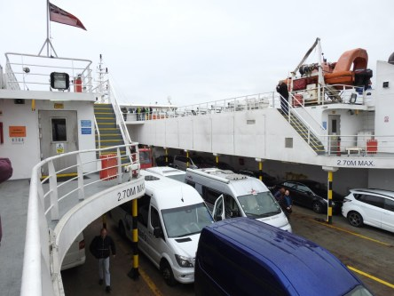](https://worldwideweatherblog.wordpress.com/wp-content/uploads/2018/04/dscn8863-desktop-resolution.jpg)

[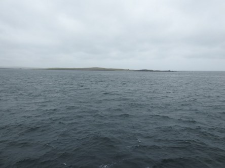](https://worldwideweatherblog.wordpress.com/wp-content/uploads/2018/04/dscn8039-desktop-resolution.jpg) _Det blåser ordentligt så det gäller att hålla i hatten om man står på övre däck._

 _Och här ser vi äntligen vår första skymt av Orkney._

_I nästa inlägg kör vi av färjan och beger oss iväg för att utforska det nordligaste av Skottland._
