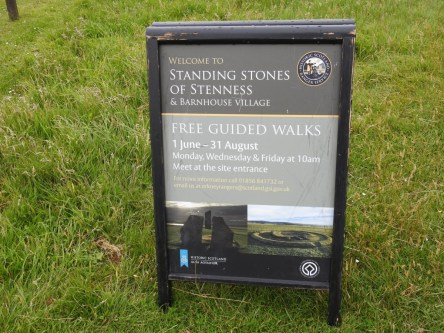
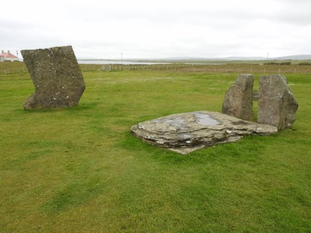
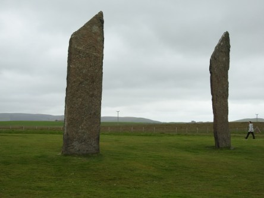
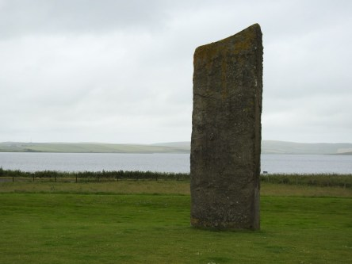
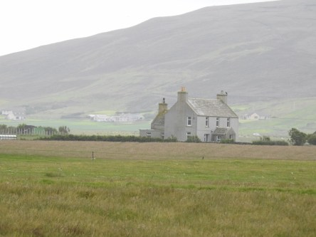
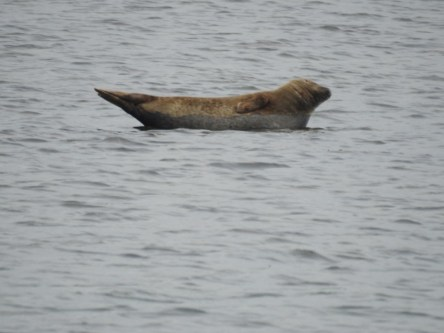
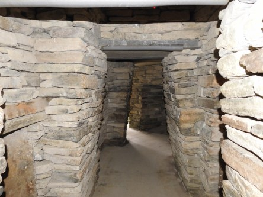
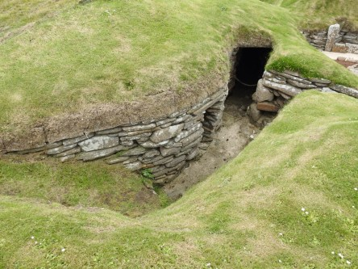
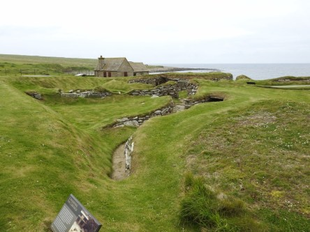
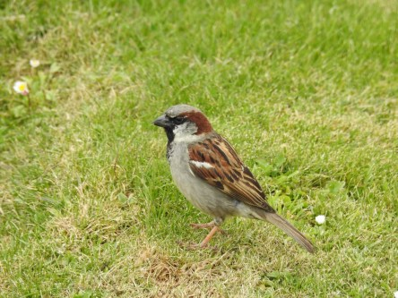

**Standing stones of Stennes och Skara Brae**

_I dagens inlägg blir det ett besök vid Standing sones of Stennes som tros vara den äldsta stensättningen på Brittiska öarna.Vill du veta mer om dem kan du läsa det [här](https://sv.wikipedia.org/wiki/Stones_of_Stenness). Därefter blir det ett besök vid Skara Brae som är Orkneys eget Pompeji i miniformat. Du kan läsa allt om Skara Brae [här](https://sv.wikipedia.org/wiki/Skara_Brae). Det finns tidigare inlägg från Skara Brae om du vill se fler bilder på dessa utgrävningar._

 ___Nedersta bilden är den första stenen som heter Odenstenen och den ligger vid bron som går till Ring Of Brodgar. Övriga bilder är vid själva stensättningen, det som finns kvar idag._

 _Nu går färden vidare mot Skara Brae._

 _Det är gott om sälar överallt i Skottland och man får ha ögonen med sig för det är lätt att tro att det är stenar i vattnet istället._

 _Innan vi går bort till utgrävningarna av Skara Brae så är det dags för lite mat i det lilla cafeet._

 _Innan vi går vidare så tittar vi in i dessa små gångar som ligger_ _en bit innan utgrävningarna. Vad dessa gångar varit en gång vet jag inte. Men de som en gång gjort dem måste vara väldigt småväxta som ni kan se av hur Johannes får gå här inne._

 _På vägen ner går vi förbi House of Skaill som vi besöker efter Skara Brae._

 _Skara Brae ligger precis nere vid stranden._

 _Några bilder från utgrävningarna. Det finns fler i mitt tidigare inlägg härifrån._

 _En tavla med en översikt över Skara Brae._

 _Den här lilla gråsparven får avsluta det här inlägget._

_I nästa inlägg besöker vi museet i House Of Skaill._
