**Vägen tillbaks till Edinburgh**

_På vägen ner till Edinburgh stannar vi till vid Silverbridge i Little Garve och vid slaget vid Culloden, Hanovarians Line Balloch vid Inverness. Vi stannar också till vid [Balnuaran of Clava](https://en.wikipedia.org/wiki/Clava_cairn) också i Balloch utanför Inverness. Dessa platser finns med i tidigare inlägg så det blir bara en snabb återblick här._

[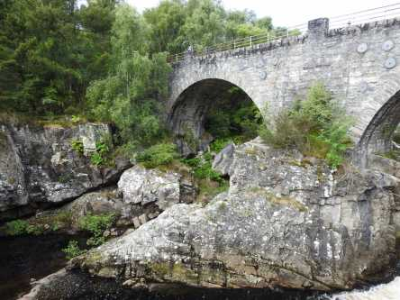](https://worldwideweatherblog.wordpress.com/wp-content/uploads/2018/12/dscn0006-1600x1200.jpg)

 _Silverbridge vid Little Garve. Det var helt underbart vackert här med bäckar och stenar bland träd och buskar._

[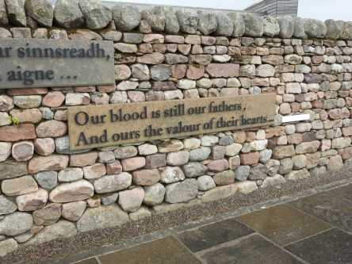](https://worldwideweatherblog.wordpress.com/wp-content/uploads/2018/12/dscn0014-1600x1200.jpg)

[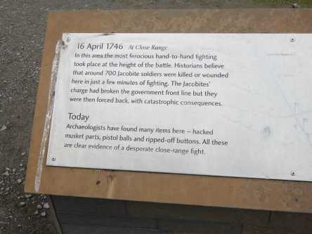](https://worldwideweatherblog.wordpress.com/wp-content/uploads/2018/12/dscn0020-1600x1200.jpg) _Nu är vi framme vid slaget vid Culloden som du kan läsa mer om [här](https://sv.wikipedia.org/wiki/Slaget_vid_Culloden) och [här](https://www.explore-inverness.com/listing/attractions/historical-sites/culloden-battlefield/)_

[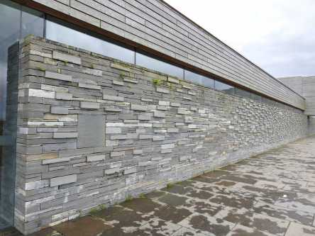](https://worldwideweatherblog.wordpress.com/wp-content/uploads/2018/12/dscn0018-1600x1200.jpg) _Varje sten i den här muren representerar en stupad soldat._

[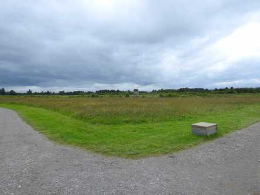](https://worldwideweatherblog.wordpress.com/wp-content/uploads/2018/12/dscn0021-1600x1200.jpg)

[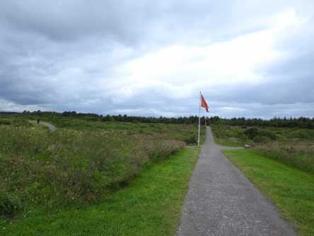](https://worldwideweatherblog.wordpress.com/wp-content/uploads/2018/12/dscn0027-1600x1200.jpg) _På väg ut till slagfältet._

[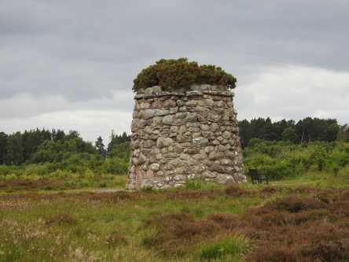](https://worldwideweatherblog.wordpress.com/wp-content/uploads/2018/12/dscn0028-1600x1200.jpg)

[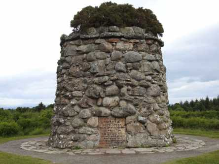](https://worldwideweatherblog.wordpress.com/wp-content/uploads/2018/12/dscn0034-1600x1200.jpg)

 _Till minne av slaget och de döda._

[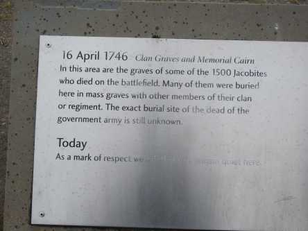](https://worldwideweatherblog.wordpress.com/wp-content/uploads/2018/12/dscn0052-1600x1200.jpg)

 _Sådana här gravstenar fanns överallt på fältet_.

 _En bild av slaget inne på museet._

 _Nästa stopp är vid gravarna vid Clava som du kan läsa om i_ _länken i inledningen på det här inlägget._

 _Informationstavla_

[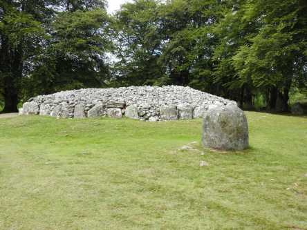](https://worldwideweatherblog.wordpress.com/wp-content/uploads/2018/12/dscn0069-1600x1200.jpg)

[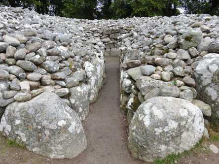](https://worldwideweatherblog.wordpress.com/wp-content/uploads/2018/12/dscn0071-1600x1200.jpg) _Gravarna som en gång i tiden hade tak också_.

 _Den här stenen har hamnat precis vid gränsen till vägen_.

[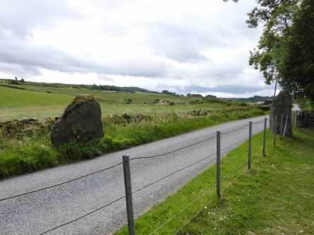](https://worldwideweatherblog.wordpress.com/wp-content/uploads/2018/12/dscn0096-1600x1200.jpg) _Vägen som går utanför gravplatsen._

 _Cullodenbrige är en vacker järnvägsbro som du kan läsa om [här](https://en.wikipedia.org/wiki/Culloden_Viaduct)_

[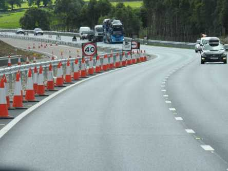](https://worldwideweatherblog.wordpress.com/wp-content/uploads/2018/12/dscn0130-1600x1200.jpg) _Och nu går färden vidare mot Edinburgh och det var gott om_ _vägarbeten på vägen ner. Man kan säga att de gillar trafikkoner_ _i Skottland. Här är vi i Kincraig._

_Nu är det inte så mycket kvar innan vi når Edinburgh och vår resa är slut._
