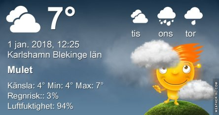

Idag går solen upp 08:33 och ned 15:35. Månen går upp 15:23 och ned 07:19 Månen är belyst 98 %. Dagens längd är 7 timmar och 2 minuter

 Dimma 3,3 C  Vindstilla  Luftfuktighet 99 %  hPa 987 Kl.01:25

 Molnigt och en del regn 6,5 C  Vindby 1,4 m/s NW  Luftfuktighet 98 %  hPa 984  Regn 2,2 mm Kl.07:55

 Blåsigt och mulet 7,1 C  Vindby 6 m/s SSW  Luftfuktighet 79 %  hPa 985 Kl.13:45

 Molnigt och blåsigt 4,4 C  Vindby 5,4 m/s N  Luftfuktighet 82 %  hPa 988  Regn 2,7 mm Kl.19:50

Högst och lägst uppmätta temperatur igår (inofficiellt privat mätare): Max 6,7 C , Min – 0,7 C Högst uppmätta vind 2,4 m/s. Högst uppmätta vindby 4,1 m/s.

Högst och lägst uppmätta temperatur igår (officiellt enligt [YR.NO](http://www.vackertvader.se/v%C3%A4derstation/karlshamn?utm_source=email&utm_medium=email&utm_campaign=asarum)) Max 6 C, Min – 1,2 C Högst uppmätta vind 4,4 m/s. Högst uppmätta vindby 9 m/s

 Nattens fyrverkeri inramad av ett fantasilandskap.
