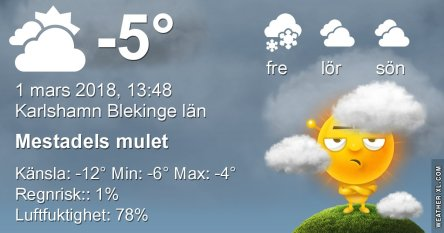

Idag går solen upp 06:53 och ned 17:33. Månen går upp 16:50 och ned 06:52 Månen är belyst 99 %. Dagens längd är 10 timmar och 40 minuter

 Växlande molnighet - 8,9 C  Vindby 3 m/s W  Luftfuktighet 64 %  hPa 1029 Kl.01:25

 Tunna slöjmoln - 8,3  Vindby 2 m/s S  Luftfuktighet 67 %  hPa 1025 Kl.07:05

 Lätt snö - 0,4 C  Vindby 4,1 m/s SSW  Luftfuktighet 57 %  hPa 1021 Kl.13:50

 Tunna slöjmoln - 6,8 C  Vindby 3,6 m/s ENE  Luftfuktighet 73 %  hPa 1017 Kl.19:50

 Vintervädret ger inte upp i första taget, tyvärr.

Högst och lägst uppmätta temperatur igår (inofficiellt privat mätare): Max - 3,3 ( ? ) C, Min – 15,4 ( ? )C Högst uppmätta vind 3,1 ( ? ) m/s. Högst uppmätta vindby 5.8 ( ? ) m/s.

Högst och lägst uppmätta temperatur igår (officiellt enligt [YR.NO](http://www.vackertvader.se/v%C3%A4derstation/karlshamn?utm_source=email&utm_medium=email&utm_campaign=asarum)) Max – 5 C, Min – 10,4 C Högst uppmätta vind 4,6 m/s. Högst uppmätta vindby 10,3 m/s

 Hungriga fåglar invaderar trädgården och maten tar snabbt slut och behöver fyllas på varje dag.
