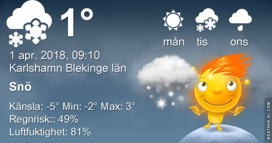
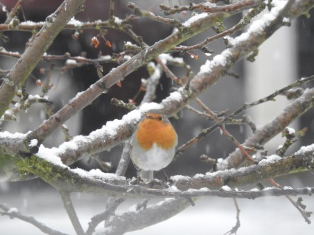
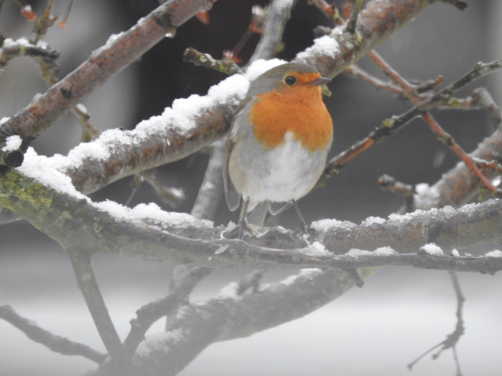

Idag går solen upp 06:32 och ned 19:38. Månen går upp 20:47 och ned 07:22 Månen är belyst 98 %. Dagens längd är 13 timmar och 6 minuter

 Molnigt - 0,1 C  Vindby 3 m/s NNE  Luftfuktighet 74 %  hPa 1000 Kl.01:30

 Molnigt - 0,4 C  Vindby 5,8 m/s SSW  Luftfuktighet 72 %   hPa 996 Kl.07:50

 Molnigt och en del snö 2,4 C  Vindby 3,1 m/s SE  Luftfuktighet 85 %  hPa 996 Kl.13:55

 Snö - 0,7 C  Vindby 2 m/s SE  Luftfuktighet 91 %  hPa 998  Snö/regn 1,5 mm Kl.19:55

 Dagens aprilskämt: Vädret 😂

Högst och lägst uppmätta temperatur igår (inofficiellt privat mätare): Max 5,9 C  , Min – 6,7 C Högst uppmätta vind 4,4 m/s. Högst uppmätta vindby 5,4 m/s.

Högst och lägst uppmätta temperatur igår (officiellt enligt [YR.NO](http://www.vackertvader.se/v%C3%A4derstation/karlshamn?utm_source=email&utm_medium=email&utm_campaign=asarum)) Max 2,4 C, Min – 3,5 C Högst uppmätta vind 3,3 m/s. Högst uppmätta vindby 7,9 m/s

 April April. Ingen tvekan om saken, det här är aprilväder i allra högsta grad. Det verkar både bofinken och rödhaken hålla med om.

 

Miss i arbetet. Igår råkade jag posta ett inlägg med mina väderikoner som inte skulle postas. Så om någon undrar vad det var för underligt inlägg så var det bara jag som var för snabb att trycka på publicera när jag inte skulle det 😂😂😂. Så kan det gå när inte haspen är på.
