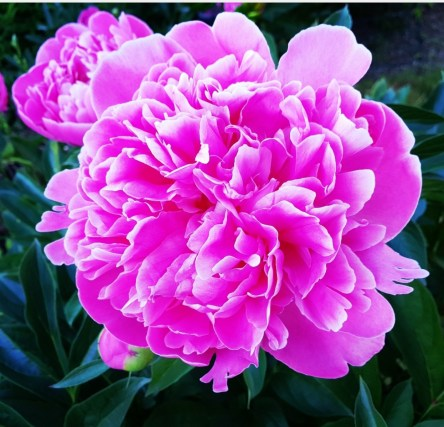

Idag går solen upp 04:21 och ned 21:35. Månen går upp 23:53 och ned 06:44 Månen är belyst 94 %. Dagens längd är 17 timmar och 14 minuter

 Klart 8,8 C  Vindby 0,3 m/s SW  Luftfuktighet 89 %  hPa 1016 Kl.02:00

 Klart 15,5 C  Vindby 2 m/s NE  Luftfuktighet 71 %  hPa 1015 Kl.06:50

 Klart 33,3 C  Vindby 2,7 m/s NW  Luftfuktighet 46 %  hPa 1014 Kl.14:05

 Klart 18,8 C  Vindby 1,6 m/s SSE  Luftfuktighet 53 %  hPa 1013 Kl.20:10

 Värmen bara fortsätter.

Högst och lägst uppmätta temperatur igår (inofficiellt privat mätare): Max 33,6 C ( i solen ), Min 10,5 C Högst uppmätta vind 2,7 m/s. Högst uppmätta vindby 5,1 m/s

Högst och lägst uppmätta temperatur igår (officiellt enligt [YR.NO](http://www.vackertvader.se/v%C3%A4derstation/karlshamn?utm_source=email&utm_medium=email&utm_campaign=asarum)) Max 25.8 C, Min 8 C Högst uppmätta vind 4 m/s. Högst uppmätta vindby 9,1 m/s

 Nu blommar doftpionerna och hela trädgården luktar ljuvligt.
