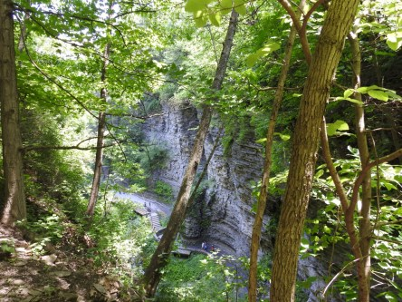
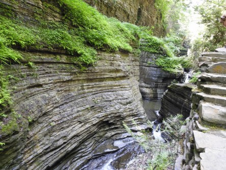
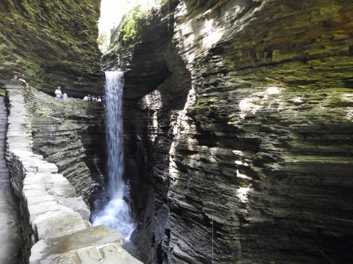
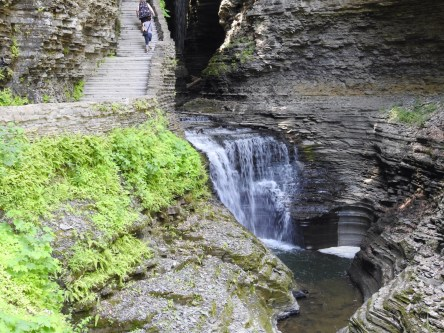
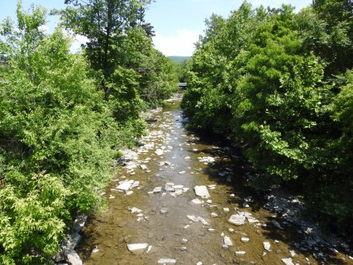

Idag går solen upp 04:17 och ned 21:51. Dagens längd är 17 timmar och 34 minuter. Det är gryning 03:15 och skymning 22:53 Det är dagsljus 19 timmar och 38 minuter. Månen går upp 23:41 och ned 07:22 Månen är belyst 93 %.

 Klart 6,4 C  Vindstilla  Luftfuktighet 91 %  hPa 1020 Kl.01:35

 Växlande molnighet 16,6 C  Vindby 1,7 m/s NE  Luftfuktighet 41 %  hPa 1020 Kl.07:45

 Växlande molnighet 24,2 C  Vindby 1,6 m/s SSE  Luftfuktighet 30 %  hPa 1019 Kl.13:15

 Klart 15,6 C  Vindby 2,7 m/s SSE  Luftfuktighet 58 %  hPa 1018 Kl.20:25

 Torkan fortsätter, det verkar inte vara någon ände på det i år.

Högst och lägst uppmätta temperatur igår (inofficiellt privat mätare): Max 24 C ( i solen ), Min 7,5 C Högst uppmätta vind 2,7 m/s. Högst uppmätta vindby 4,8 m/s

Högst och lägst uppmätta temperatur igår (officiellt enligt [YR.NO](http://www.vackertvader.se/v%C3%A4derstation/karlshamn?utm_source=email&utm_medium=email&utm_campaign=asarum)) Max 20,9 C, Min 5,4 C Högst uppmätta vind 4,1 m/s. Högst uppmätta vindby 9,2 m/s

 Nyss hemkomna från New York så är det mycket att smälta som vi har sett. Dessa bilder är från ett helt fantastiskt ställe som heter Watkins Glen Park och är ett naturreservat med en helt underbar promenad. Det ligger i staten New York på vägen mot Kanada. Det blev en upp- levelse vi aldrig kommer att glömma.
