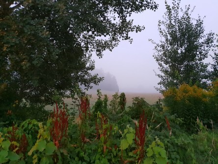
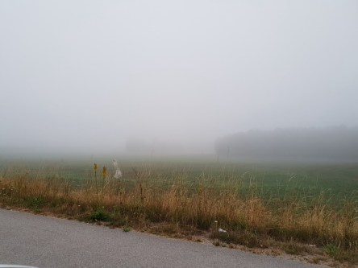

Idag går solen upp 05:03 och ned 21:09. Dagens längd är 16 timmar och 06 minuter. Det är gryning 04:14 och skymning 21:58 Det är dagsljus 17 timmar och 44 minuter. Månen går upp 23:05 och ned 09:50 Månen är belyst 84 %.

 Halvklart 19,5 C  Vindby 0,7 m/s W  Luftfuktighet 94 %  hPa 1014 Kl.02:00

 Dimma  21,5 C  Vindby 1,4 m/s N  Luftfuktighet 96 %  hPa 1015 Kl.06:40

 Halvklart 35,3 C  Vindby 2,2 m/s SW  Luftfuktighet 31 %  hPa 1015 Kl.13:50

 Växlande molnighet 25,7 C  Vindby 1 m/s NE   Luftfuktighet 81 %  hPa 1015 Kl.20:05

 Djup suck!!!!

Högst och lägst uppmätta temperatur igår (inofficiellt privat mätare): Max 34,2 C ( i solen ), Min 14,9 C Högst uppmätta vind 2,7 m/s. Högst uppmätta vindby 4,2 m/s

Högst och lägst uppmätta temperatur igår (officiellt enligt [YR.NO](http://www.vackertvader.se/v%C3%A4derstation/karlshamn?utm_source=email&utm_medium=email&utm_campaign=asarum)) Max 27,9 C, Min 14,2 C Högst uppmätta vind 4,6 m/s. Högst uppmätta vindby 7,6 m/s

 Natten och morgonen var fruktansvärt kvav och med tjock dimma.

 Och så här ser det ut på affärernas vattenhyllor.
