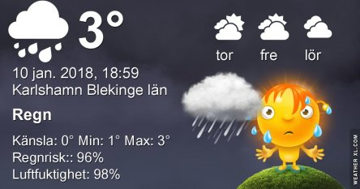
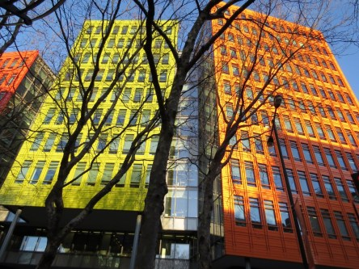

Idag går solen upp 08:28 och ned 15:48. Månen går upp 01:36 och ned 12:12 Månen är belyst 39 %. Dagens längd är 7 timmar och 20 minuter

 Växlande molnighet 2,5 C  Vindby 4,6 m/s NE  Luftfuktighet 72 %  hPa 1014 Kl.01:45

 Molnigt 3,6 C  Vindby 5 m/s WNW  Luftfuktighet 79 %  hPa 1012 Kl.06:50

 Regn 3,5 C  Vindby 5 m/s SW  Luftfuktighet 99 %  hPa 1011  Regn 2,7 mm Kl.14:30

 Regn 2,2 C  Vindby 2,4 m/s NW  Luftfuktighet 97 %  hPa 1012  Regn 7 mm Kl.19:50

 Grått och regn igen

Högst och lägst uppmätta temperatur igår (inofficiellt privat mätare): Max 3,9 C , Min – 3,7 C Högst uppmätta vind 3,4 m/s. Högst uppmätta vindby 7 m/s.

Högst och lägst uppmätta temperatur igår (officiellt enligt [YR.NO](http://www.vackertvader.se/v%C3%A4derstation/karlshamn?utm_source=email&utm_medium=email&utm_campaign=asarum)) Max 4 C, Min – 3,6 C Högst uppmätta vind 3,7 m/s. Högst uppmätta vindby 10,1 m/s

 Det är så otroligt grått och tråkigt ute just nu så idag får det bli en bild på dessa färgglada hyreshus i London istället.
