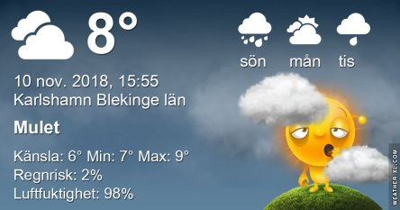
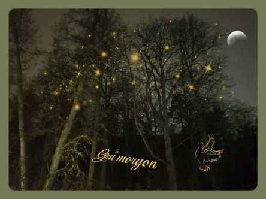

Idag går solen upp 07:27 och ned 16:01 Dagens längd är 8 timmar och 34 minuter. Det är gryning 06:46 och skymning 16:43 Det är dagsljus 9 timmar och 57 minuter. Månen går upp 10:16 och ned 17:56 Månen är belyst 6 %.

 Molnigt 8 C  Vindby 1,2 m/s ENE  Luftfuktighet 95 %  hPa 1010 Kl.02:40

 Molnigt 7,6 C  Vindby 1 m/s E  Luftfuktighet 95 %  hPa 1009  Regn 0,5 mm Kl.06:55

 Molnigt 8,1 C  Vindby 1,7 m/s NW  Luftfuktighet 93 %  hPa 1008 Kl.13:30

 Molnigt 8,5 C  Vindby 1,4 m/s ENE  Luftfuktighet 88 %  hPa 1008  Regn 1 mm Kl.19:50

 Det går inte att skilja dagarna åt längre. Samma väder dygnet runt. Varje dag!

Högst och lägst uppmätta temperatur igår (inofficiellt privat mätare): Max 9,1 C , Min 6,8 C Högst uppmätta vind 1 m/s, Högst uppmätta vindby 1,4 m/s

Högst och lägst uppmätta temperatur igår (officiellt enligt [YR.NO](http://www.vackertvader.se/v%C3%A4derstation/karlshamn?utm_source=email&utm_medium=email&utm_campaign=asarum)) Max 8,2 C, Min 6,8 C Högst uppmätta vind 2,4 m/s. Högst uppmätta vindby 4,4 m/s

 Jag fick en massa svamp av en svampkunnig kompis idag. Eftersom det var mörkt ute så var det svårt att få bra bilder på dem. Dessutom är jag inte särskilt duktig på macro. Så det fick bli bildlek istället. Lite färg i allt det mörka och gråa.

 Ett försök att piffa upp morgonen som var den gråaste på länge.

https://www.youtube.com/watch?v=129kuDCQtHs

Jag blev lite nostalgisk ikväll när jag tänkte tillbaks på vår New Yorkresa i somras. Av en slump sprang vi på Bruce Springsteen när vi skulle ta oss hem till hotellet en kväll. Han har väl aldrig varit min största favorit men ändå en av dem som jag lyssnade ganska mycket på honom när jag var yngre. Och den här videon var min favorit och jag kunde se och lyssna på den hur många gånger som helst. Här under ser nu hur han ser ut idag, 69 år gammal. Bilderna tog jag när vi stötte på honom på Broadway.

