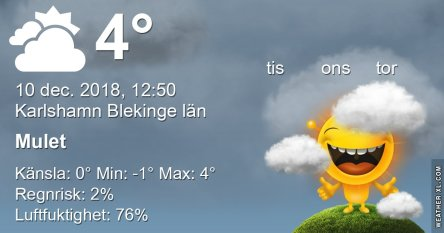

Idag går solen upp 08:22 och ned 15:25 Dagens längd är 7 timmar och 3 minuter. Det är gryning 07:34 och skymning 16:12 Det är dagsljus 8 timmar och 38 minuter. Månen går upp 10:48 och ned 18:16 Månen är belyst 7 %.

 Mest klart - 2 C  Vindby 0,7 m/s E  Luftfuktighet 84 %  hPa 990 Kl.02:20

 Halvklart - 2,2 C  Vindstilla  Luftfuktighet 89 %  hPa 993 Kl.07:05

 Mest molnigt 4,7 C  Vindby 2,2 m/s ENE  Luftfuktighet 74 %  hPa 994 Kl.13:05

 Mest molnigt 1,2 C  Vindby 1,2 m/s W  Luftfuktighet 75 %  hPa 996 Kl.20:00

 Idag har solen äntligen visat sig igen!

Högst och lägst uppmätta temperatur igår (inofficiellt privat mätare) Max 7,8 C , Min 2 C Högst uppmätta vind 3,4 m/s, Högst uppmätta vindby 7,8 m/s

Högst och lägst uppmätta temperatur igår (officiellt enligt [YR.NO](http://www.vackertvader.se/v%C3%A4derstation/karlshamn?utm_source=email&utm_medium=email&utm_campaign=asarum)) Max 6,8 C, Min 0,4 C Högst uppmätta vind 3,6 m/s. Högst uppmätta vindby 8,9 m/s

\[gallery type="rectangular" link="file" size="large" ids="25912,25911,25913"\]

Några nytagna bilder från dagen och kvällen när solen äntligen visade sig igen.
