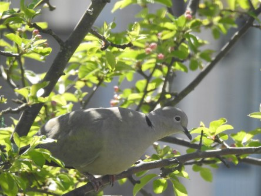

Idag går solen upp 04:57 och ned 20:57. Månen går upp 03:45 och ned 14:15 Månen är belyst 31 %. Dagens längd är 16 timmar och 0 minuter

 Mest klart 8,8 C  Vindby 1,2 m/s NE  Luftfuktighet 74 %  hPa 1008 Kl.01:30

 Halvklart 19,9 C  Vindstilla  Luftfuktighet 61 %  hPa 1006 Kl.07:35

 Halvklart 29,5 C  Vindby 2,2 m/s SSE  Luftfuktighet 48 %  hPa 1007 Kl.13:25

 Mest molnigt 19,3 C  Vindby 2,6 m/s NE  Luftfuktighet 59 %  hPa 1008 Kl.20:00

 Ännu en rekordvarm dag med sol och tunna moln.

Högst och lägst uppmätta temperatur igår (inofficiellt privat mätare): Max 31 C ( i solen ) , Min 4,1 C Högst uppmätta vind 3,4 m/s. Högst uppmätta vindby 5,8 m/s.

Högst och lägst uppmätta temperatur igår (officiellt enligt [YR.NO](http://www.vackertvader.se/v%C3%A4derstation/karlshamn?utm_source=email&utm_medium=email&utm_campaign=asarum)) Max 22,6 C, Min 3 C Högst uppmätta vind 5,9 m/s. Högst uppmätta vindby 11,1 m/s

 Några av mina besökare i trädgården.
