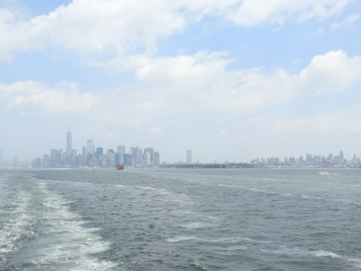
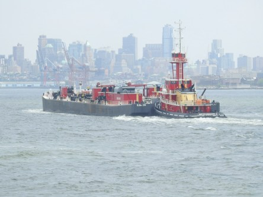

Idag går solen upp 04:27 och ned 21:44. Dagens längd är 17 timmar och 17 minuter. Det är gryning 03:28 och skymning 22:43 Det är dagsljus 19 timmar och 15 minuter. Månen går upp 02:27 och ned 18:28 Månen är belyst 13 %.

 Molnigt 13,8 C  Vindby 0,2 m/s SE  Luftfuktighet 88 %  hPa 1011 K.01:35

 Molnigt 18,8 C  Vindby 1,2 m/s SE  Luftfuktighet 71 %  hPa 1013 Kl.07:20

 Mest molnigt 33,3 C  Vindby 4,4 m/s SE  Luftfuktighet 41 %   hPa 1014 Kl.13:30

 Molnigt 19,9 C  Vindby 3,4 m/s WSW  Luftfuktighet 60 %  hPa 1015 Kl.20:00

 Detta är otroligt! Det har snart varit torka i fyra månader, sen April! Bara 38 mm regn under hela den perioden.

Högst och lägst uppmätta temperatur igår (inofficiellt privat mätare): Max 29,9 C  ( i solen ), Min 14,2 C Högst uppmätta vind 3,4  m/s. Högst uppmätta vindby 5,8  m/s

Högst och lägst uppmätta temperatur igår (officiellt enligt [YR.NO](http://www.vackertvader.se/v%C3%A4derstation/karlshamn?utm_source=email&utm_medium=email&utm_campaign=asarum)) Max 23,3 C, Min 13,2 C Högst uppmätta vind 3,9 m/s. Högst uppmätta vindby 8,7 m/s

 Några bilder som jag tog från färjan över till Staten Island.
