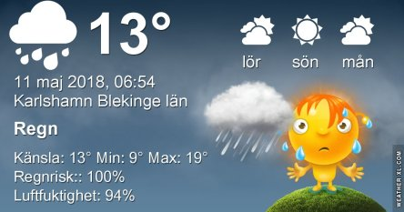
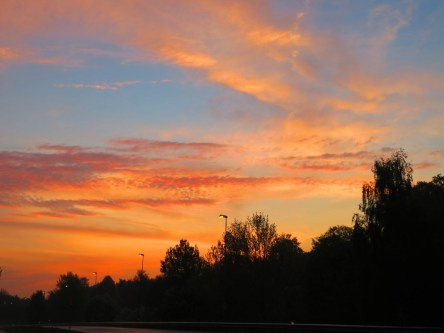
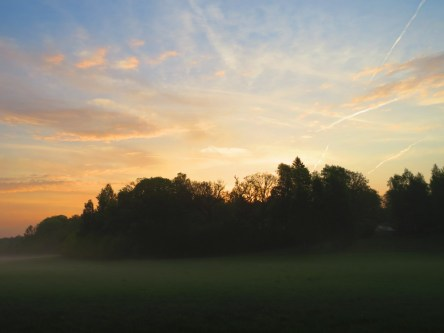
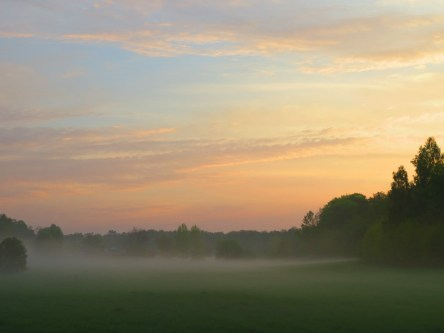
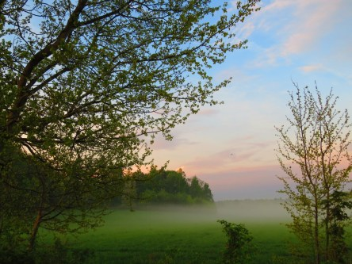

Idag går solen upp 04:55 och ned 20:59. Månen går upp 04:04 och ned 15:30 Månen är belyst 22 %. Dagens längd är 16 timmar och 4 minuter

 Åska och regn 11,8 C  Vindby 3,4 m/s SW  Luftfuktighet 93 %  hPa 1009  Regn 0,5 mm Kl.02:15

 Lätt regn 11,6 C  Vindby 1 m/s W  Luftfuktighet 97 %  hPa 1011  regn 1 mm Kl.07:15

 Molnigt 22,6 C  Vindby 1,6 m/s NW  Luftfuktighet 77 %  hPa 1013 Kl.14:20

 Mest molnigt 17,4 C  Vindby 0,8 m/s NW  Luftfuktighet 88 %  hPa 1014 Kl.20:00

 Efter åska och lite regn på natten så gick solen upp men det blev inte långvarigt. Snart tog molnen överhanden igen.

Högst och lägst uppmätta temperatur igår (inofficiellt privat mätare): Max 30,4 C ( i solen ) , Min 7 C Högst uppmätta vind 3,1 m/s. Högst uppmätta vindby 4,4 m/s.

Högst och lägst uppmätta temperatur igår (officiellt enligt [YR.NO](http://www.vackertvader.se/v%C3%A4derstation/karlshamn?utm_source=email&utm_medium=email&utm_campaign=asarum)) Max 22,5 C, Min 9,2 C Högst uppmätta vind 5,1 m/s. Högst uppmätta vindby 10 m/s

 Åskmolnen tornade upp sig igårkväll och det blev ett ordentligt åskväder som höll på nästan hela natten.

 Soluppgången skiftade färg under morgonen för att till slut ge upp mot molnen som hopade sig igen.

 Dimman låg tät på marken och solen steg längre och längre upp.

 Här lyser hon i sin fulla kraft för att om några minuter vara helt dold bakom mörka moln.

 Här tar molnen över mer och mer och snart syns hon inte mer för idag.
