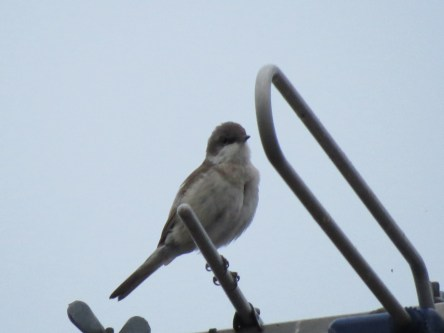

Idag går solen upp 04:13 och ned 21:47. Månen går upp 03:25 och ned 18:22 Månen är belyst 10 %. Dagens längd är 17 timmar och 34 minuter

 Molnigt 17 C  Vindby 1,6 m/s NE  Luftfuktighet 79 %  hPa 1003 Kl.02:10

 Molnigt 18,9 C  Vindby 0,8 m/s W  Luftfuktighet 82 %  hPa 1002 Kl.06:55

 Växlande molnighet 25,1 C  Vindby 5,4 m/s W  Luftfuktighet 51 %  hPa 1002 Kl.13:46

 Växlande molnighet 17 C  Vindby 2,4 m/s SW  Luftfuktighet 57 %  hPa 1001 Kl.20:15

 Det började bra med mörka moln och två droppar regn men sen blev det soligt, blåsigt och varmt igen.

Högst och lägst uppmätta temperatur igår (inofficiellt privat mätare): Max 31,3 C ( i solen ), Min 8,9 C Högst uppmätta vind 2,4 m/s. Högst uppmätta vindby 7,6 m/s

Högst och lägst uppmätta temperatur igår (officiellt enligt [YR.NO](http://www.vackertvader.se/v%C3%A4derstation/karlshamn?utm_source=email&utm_medium=email&utm_campaign=asarum)) Max 25 C, Min 8,4 C Högst uppmätta vind 4,5 m/s. Högst uppmätta vindby 8,3 m/s

 Jag fick några bilder, tyvärr inte så skarpa, på vad jag tror är en ärtsångare idag. Den satt långt iväg och ljuset var inte det bästa. Men den får ändå vara med idag eftersom det är första gången jag ser den här fågeln.
