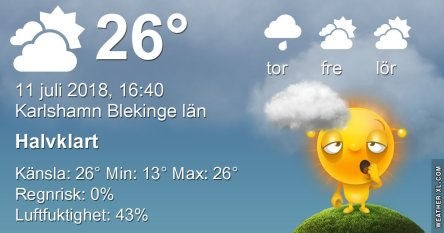

Idag går solen upp 04:28 och ned 21:43. Dagens längd är 17 timmar och 15 minuter. Det är gryning 03:30 och skymning 22:41 Det är dagsljus 19 timmar och 11 minuter. Månen går upp 03:05 och ned 19:44 Månen är belyst 6 %.

 Molnigt 13,4 C  Vindby 0,7 m/s SW  Luftfuktighet 88 %  hPa 1015 Kl.01:55

 Mest molnigt 20,3 C  Vindby 2,7 m/s N  Luftfuktighet 66 %  hPa 1014 Kl.07:30

 Mest molnigt 31,5 C  Vindby 3,4 m/s NE  Luftfuktighet 35 %  hPa 1013 Kl.13:25

 Tunna moln 21,1 C  Vindby 2,2 m/s SSE  Luftfuktighet 55 %  hPa 1012 Kl.20:00

 Det finns en minimal chans till regn imorgon. Jag håller alla tummar jag kan hitta nu.

Högst och lägst uppmätta temperatur igår (inofficiellt privat mätare): Max 31,4 C  ( i solen ), Min 12,8 C Högst uppmätta vind 3,1  m/s. Högst uppmätta vindby 5,4  m/s

Högst och lägst uppmätta temperatur igår (officiellt enligt [YR.NO](http://www.vackertvader.se/v%C3%A4derstation/karlshamn?utm_source=email&utm_medium=email&utm_campaign=asarum)) Max 23,4 C, Min 12,5 C Högst uppmätta vind 3,8 m/s. Högst uppmätta vindby 8,9 m/s

 Lek med PIP effekter.
