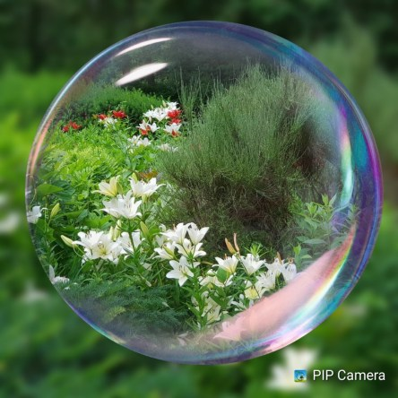

Idag går solen upp 04:30 och ned 21:42. Dagens längd är 17 timmar och 12 minuter. Det är gryning 03:31 och skymning 22:40 Det är dagsljus 19 timmar och 09 minuter. Månen går upp 03:56 och ned 20:50 Månen är belyst 2 %.

 Mest klart 12,5 C  Vindstilla  Luftfuktighet 94 %  hPa 1012 Kl.01:30

 Mest molnigt 17,7 C  Vindby 2 m/s SE  Luftfuktighet 80 %  hPa 1011 Kl.07:20

 Mest molnigt 24,9 C  Vindby 4 m/s NE  Luftfuktighet 37 %  hPa 1010 Kl.13:15

 Regn!! 18,3 C  Vindby 0,3 m/s S  Luftfuktighet 93 %  hPa 1010  Regn 2,2 mm Kl.20:00

 Idag har det äntligen varit lite svalare och till och med någon droppe regn.

Högst och lägst uppmätta temperatur igår (inofficiellt privat mätare): Max 32,1 C  ( i solen ), Min 12,3 C Högst uppmätta vind 3,7  m/s. Högst uppmätta vindby 6,5  m/s

Högst och lägst uppmätta temperatur igår (officiellt enligt [YR.NO](http://www.vackertvader.se/v%C3%A4derstation/karlshamn?utm_source=email&utm_medium=email&utm_campaign=asarum)) Max 25,5 C, Min 11,6 C Högst uppmätta vind 5,8 m/s. Högst uppmätta vindby 10,7 m/s

 Mer lek med bilder.
