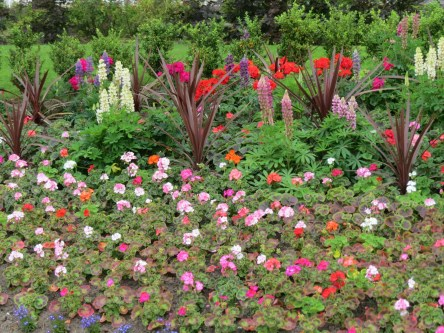
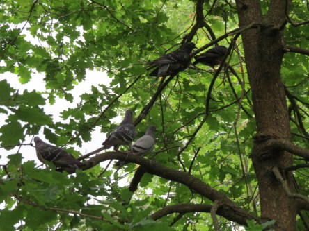

Idag går solen upp 05:24 och ned 20:45. Dagens längd är 15 timmar och 21 minuter. Det är gryning 04:40 och skymning 21:30 Det är dagsljus 16 timmar och 50 minuter. Månen går upp 06:35 och ned 21:23 Månen är belyst 1 %.

 Regn 12,1 C  Vindby 3,1 m/s SE  Luftfuktighet 96 %  hPa 1006  Regn 3,7 mm Kl.02:15

 Mest molnigt 13,2 C  Vindby 2,6 m/s NNW  Luftfuktighet 90 %  hPa 1008  Regn 7,2 mm Kl.07:20

 Mest molnigt 24,5 C  Vindby 4,6 m/s SSW  Luftfuktighet 49 %  hPa 1009 Kl.13:55

 Molnigt 13,3 C  Vindby 1 m/s E  Luftfuktighet 78 %  hPa 1009 Kl.19:45

 Äntligen! Regn halva natten, och svalt.

Högst och lägst uppmätta temperatur igår (inofficiellt privat mätare): Max 25 C ( i solen ), Min 8,9 C Högst uppmätta vind 5,4 m/s. Högst uppmätta vindby 10 m/s

Högst och lägst uppmätta temperatur igår (officiellt enligt [YR.NO](http://www.vackertvader.se/v%C3%A4derstation/karlshamn?utm_source=email&utm_medium=email&utm_campaign=asarum)) Max 22,7 C, Min 9,3 C Högst uppmätta vind 4 m/s. Högst uppmätta vindby 10 m/s

 Gjorde en återblick på vår Skottlandsresa 2014. Det här är lite bilder på blommor i Glasgow.

 Och ett "duvträd"

 Tänk vad tiden springer iväg. Det är redan fyra år sen vi var där!
