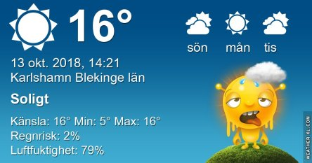
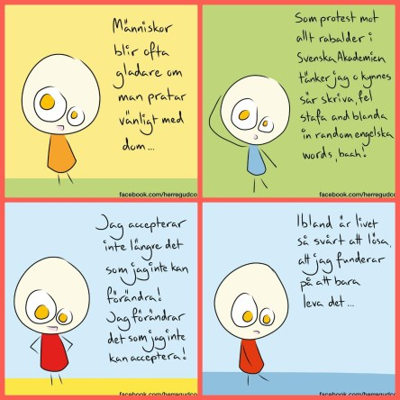
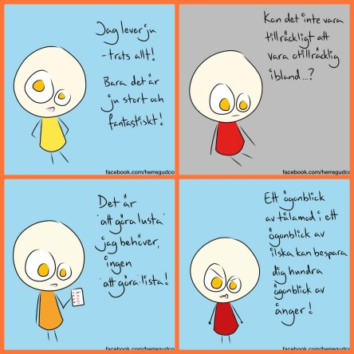

Idag går solen upp 07:28 och ned 18:05. Dagens längd är 10 timmar och 37 minuter. Det är gryning 06:50 och skymning 18:43 Det är dagsljus 11 timmar och 53 minuter. Månen går upp 12:24 och ned 20:25 Månen är belyst 17 %.

 Klart 5,1 C  Vindstilla  Luftfuktighet 95 %  hPa 1020 Kl.01:55

 Klart 4,1 C  Vindstilla  Luftfuktighet 96 %  hPa 1020 Kl.06:50

 Halvklart 23,2 C  Vindby 2,2 m/s NNE  Luftfuktighet 55 %   hPa 1019 Kl.13:45

 Mest klart 8,9 C  Vindstilla  Luftfuktighet 89 %  hPa 1019 Kl.19:50

 Högsommar idag igen. Nu är det verkligen torrt och varmt igen!

Högst och lägst uppmätta temperatur igår (inofficiellt privat mätare): Max 21,4 C , Min 6,3 C Högst uppmätta vind 1,7 m/s, Högst uppmätta vindby 4,4 m/s

Högst och lägst uppmätta temperatur igår (officiellt enligt [YR.NO](http://www.vackertvader.se/v%C3%A4derstation/karlshamn?utm_source=email&utm_medium=email&utm_campaign=asarum)) Max 16,6 C, Min  4,3 C Högst uppmätta vind 3 m/s. Högst uppmätta vindby 7 m/s

 Jag vet! Jag har fått de här på hjärnan, men jag kan inte hjälpa det. Hoppas ni har överseende 😂😉 De är ju beroendeframkallande.
